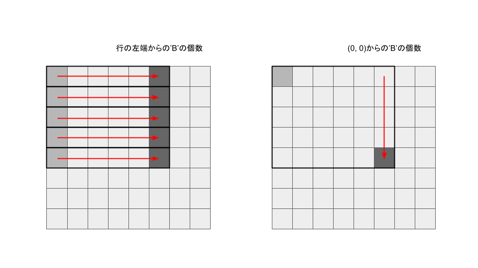
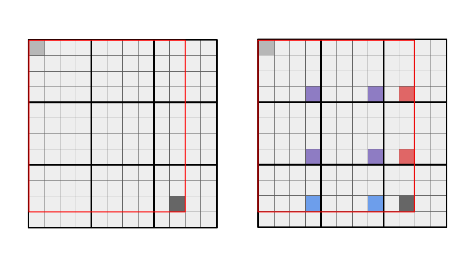
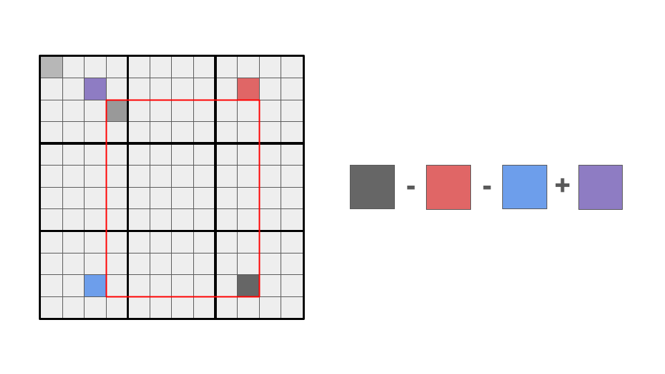

<script type="text/javascript" id="MathJax-script" async src="https://cdn.jsdelivr.net/npm/mathjax@3/es5/tex-chtml.js"></script>

# Atcoder ABC 331 反省
実は初めての5完でした。最後の最後に、break;のコードを書き忘れて1ペナ。

perfは1379で、今の実力からすると上振れですが、安定して出せるようしたいです。

今日で緑になりました。Atcoderに本格的に参戦してから約2ヶ月かかりました。

## A問題
dayに1足して、繰り上げを連鎖的に行う処理でOKです。5分

```cpp
int main(){
    int M, D; cin >> M >> D;
    int y, m, d; cin >> y >> m >> d;

    d++;
    if(d > D) m++, d = 1;
    if(m > M) y++, m = 1;

    cout << y << " " << m << " " << d << endl;
    return 0;
}
```

## B問題
シンプルに全探索しました。タイポで時間かかりました。自分はミスが多めなので、ミスを修正する力もつけたいところです。7分

## C問題
いちいち条件を満たす物を探して計算すると\\(O(N^2)\\)となり間に合うわけがないです。

そのためまず数列\\(A\\)の合計値を計算し、それぞれの値とその個数をmapで保持しておきます。

次にmapの要素を、keyが小さいものから取り出し、値とその個数の積をcntに加算していきます。

cntはその値までの累積和を示すため、mapにsum - cntを格納しておくことで、最終的に\\(O(logN)\\)の計算量で条件を満たす値を出力することができます。

mapをint, intにすると、コーナーケースでオーバーフローして落ちそうだったので、long longを使用。7分

```cpp
int main(){
    int n; cin >> n;
    vector<ll> a(n); rep(i, n) cin >> a[i];

    map<ll, ll> mp;
    rep(i, n) mp[a[i]]++;

    ll sum = 0;
    rep(i, n) sum += a[i];

    ll cnt = 0;
    for(auto x : mp){
        cnt += x.first * x.second;
        mp[x.first] = sum - cnt;
    }

    rep(i, n) cout << mp[a[i]] << " ";
    cout << endl;

    
    return 0;
}
```

## D問題
この問題はdiff 1361ついているんですけど、個人的には簡単でした。相性が良かったのかもしれません。相変わらず実装力には難ありですが。

まず、ナイーブな実装を考えると、クエリの度に数え上げる方法、普通にありえない。

nの制約が弱いことが気になった。これはnに関する計算は\\(O(N^2)\\)まで認められるということを暗示しているのでは??

### \\((0, 0)\\)から、強い制約をかけた\\((i, j)\\)までの黒のマスの個数
所詮同じ盤面の繰り返しなので、まずはクエリの数字が全てnより小さいときに着目してみましょう。

\\((0, 0)\\)から\\((i, j)\\)までの黒のマスをあらかじめ数えておけば、クエリごとに\\(O(1)\\)で対応できそうです。

まず、行方向の累積和を計算する。これによって\\((i, 0)\\)から\\((i, j)\\)までの黒のマスの数を計算することに成功します。
次に列方向の累積和を計算することによって\\((0, 0)\\)から\\((i, j)\\)までの黒のマスの数を計算することができます。



このような処理によって\\(O(N^2)\\)の計算量で\\((0, 0)\\)から\\((i, j)\\)までの黒のマスの個数を数え上げることができます。今回はこのデータをdtを呼びます。

### \\((0, 0)\\)から、任意の\\((i, j)\\)までの黒のマスの個数

次に、任意の\\((i, j)\\)について、\\((0, 0)\\)から\\((i, j)\\)までの黒のマスの個数が何個あるかということを考えます。



左図のような状態を考えると、すぐに右図のように計算できることが思い付きます。

つまり、4種類の色(赤、青、紫、濃灰)の場所に格納されているdtの値を加算することで欲しい値を求めることができます。

この処理は複数回行うため、関数にしておきましょう。

### 任意の\\((a, b)\\)から、任意の\\((c, d)\\)までの黒のマスの個数 問題の解

高校数学の集合の数とかでやったような操作を行うことで解を導くことができます。



先ほど作成した関数を4回使用することで求めることが可能です。

注意したいのがa-1, b-1のマスの情報を使用するため、a, bが0の場合配列外参照となることです。

関数の引数に負の数が入力されたときには、即座に0返すという処理で対処しました。

ところどころ変数を逆に書いていたりミスが多かったので40分くらいかかりました...

```cpp
ll dt[1007][1007];
ll n;

ll cal(ll a, ll b){
    if(a < 0 || b < 0) return 0;
    else if(a < n && b < n) return dt[a][b];
    else if(a < n){
        ll e = b / n;
        b %= n;
        ll ans = dt[a][n-1]*e + dt[a][b];
        return ans;
    }
    else if(b < n){
        ll e = a / n;
        a %= n;
        ll ans = dt[n-1][b]*e + dt[a][b];
        return ans;
    }
    else{
        ll e = a / n;
        ll f = b / n;
        a %= n, b %= n;
        ll ans = dt[n-1][n-1]*e*f + dt[a][n-1]*f + dt[n-1][b]*e + dt[a][b];
        return ans;
    }
}
int main(){
    int q; cin >> n >> q;
    vector<string> p(n); rep(i, n) cin >> p[i];

    // 行の累積和計算
    rep(i, n){
        ll cnt = 0;
        rep(j, n){
            if(p[i][j] == 'B') cnt++;
            dt[i][j] = cnt;
        }
    }

    // 列の累積和計算
    rep(i, n){
        ll cnt = 0;
        rep(j, n){
            cnt += dt[j][i];
            dt[j][i] = cnt;
        }
    }

    // クエリに対応
    rep(i, q){
        ll a, b, c, d; cin >> a >> b >> c >> d;
        ll ans =  (cal(c, d)) - (cal(c, b-1)) - (cal(a-1, d)) + (cal(a-1, b-1));
        cout << ans << endl;
    }
    return 0;
}
```

## E問題
解法が思いつくまでの時間が今回といた5問では一番長かったです。

どうやっても\\(O(N^2)\\)となるやり方しか思いつかず、手が止まっていたのですが、\\(L\\)の制約の弱さがめっちゃ気になりました。

主食と副菜の組み合わせは最大\\(10^10\\)程度あるのに対し、\\(L\\)は高々は\\(10^5\\)、あからさまに制約が弱い...

ここでおそらく\\(L\\)に着目する問題と推測しました。

Atcoderで計算量がいい感じのアルゴリズムが見つからなかった場合、存在するが思いついてないパターンと、思いついている実装が実は計算量がそこまでではないの2通りあると最近感じています(ABC329F マージテクなど)。
おそらく今回は後者と仮定。

さらに一週間前のABC330Eであったmexでは高々n+1の状態を管理すれば良いという問題だったことを思い出して、今回もl+1しか注目されないのでは??と考えました。

次のような操作を考えました。

1. ダメなペアをvector<set<int>>のように管理する。
2. bの方は価格と番号をpairにして格納し、降順にソートしておく。
3. aから1品、順に選ぶ、bの最大値から順に見ていく、ダメなペアの場合はループを継続。
4. 良いペアの場合は暫定の最大値の比較を行い、bに関するループを抜ける。
5. 2-4の操作を繰り返し行う。

この操作によって、ループはl+1周で抑えることができます。setに格納したペアの判定を行うだけなので内部の操作は対数時間に抑えることができます。

今考えると、主食ごとにsetを管理したのですが、そんなことせずにset<pair<int, int>>にinsertするだけで十分に間に合いそうですね。

break;を書き忘れて一回提出したのが勿体無い。30分1WA

### Eのコードを書いていて発生したミス

- iをa[i]と書いて配列外参照した。
- sortの時pairを使用しているためgreater<pair<ll, ll>>()とする必要がある。
- この2個でテンパってbreak;を書き忘れた。

```cpp
int main(){
    ll n, m, l; cin >> n >> m >> l;
    vector<ll> a(n), b(m);
    rep(i, n) cin >> a[i];
    rep(i, m) cin >> b[i];

    vector<pair<ll, ll>> dt(m);
    rep(i, m){
        dt[i].first = b[i];
        dt[i].second = (ll)i;
    }
    sort(dt.begin(), dt.end(), greater<pair<ll, ll>>());

    vector<set<ll>> g(n);
    rep(i, l){
        ll c, d; cin >> c >> d;
        c--, d--;
        g[c].insert(d);
    }

    ll ans = 0;
    rep(i, n){
        rep(j, m){
            if(g[i].find(dt[j].second) == g[i].end()){ // ダメな組み合わせにないなら
                chmax(ans, a[i]+dt[j].first);
                break; //break書き忘れ
            }
        }
    }

    cout << ans << endl;
    return 0;
}
```