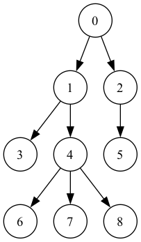

# ABC213 D問題
今回はこちらの問題を解いていきます。

<a href="https://atcoder.jp/contests/abc213/tasks/abc213_d" target="_blank">D - Takahashi Tour</a>

## 解説
この問題は、深さ優先探索においてルートノードから探索を開始して、経路を表示してくださいという問題です。

遷移先が未探索の場合、遷移先の探索->自身の探索の順で再帰を回すことでうまく経路を出力することができます。



- 最初にルートノードを挿入して処理を開始 (**0**)
- 0に到達 (0, **1**)
- 1に到達 (0, 1, **3**)
- 3に到達 (0, **1**)
- 1に到達 (0, 1, **4**)
- 4に到達 (0, 1, 4, **6**)
- 6に到達 (0, 1, **4**)
- 4に到達 (0, 1, 4, **7**)
- 7に到達 (0, 1, **4**)
- 4に到達 (0, 1, 4, **8**)
- 8に到達 (0, 1, **4**)
- 4に到達 (0, **1**)
- 1に到達 (**0**)
- 0に到達 (0, **2**)
- 2に到達 (0, 2, **5**)
- 5に到達 (0, **2**)
- 2に到達 (**0**)
- 0に到達 ()
- stack is empty 処理を終了します


```cpp
bool flag[200007];
vector<int> ans;

void dfs(Graph &g, int v){
    ans.push_back(v);
    if(!flag[v]){
        flag[v] = true;
        for(int x : g[v]) if(!flag[x]) dfs(g, x), dfs(g, v);
    }
}

int main(){
    int n; cin >> n;
    Graph g(n);
    rep(i, n-1){
        int a, b; cin >> a >> b;
        a--, b--;
        g[a].push_back(b);
        g[b].push_back(a);
    }
    rep(i, n) sort(g[i].begin(), g[i].end());

    dfs(g, 0);

    rep(i, ans.size()) cout << ans[i]+1 << " ";
    cout << endl;
    return 0;
}
```
