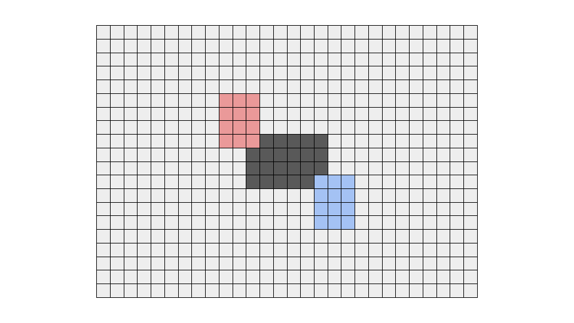

<script type="text/javascript" id="MathJax-script" async src="https://cdn.jsdelivr.net/npm/mathjax@3/es5/tex-chtml.js"></script>

# ABC307 C問題
今回はこちらの問題を解いていきます。

<a href="https://atcoder.jp/contests/abc307/tasks/abc307_c" target="_blank">C - Ideal Sheet</a>

## 解説

### 仮説と提出、それから2WA
無限に広がる盤面に与えられたシートを貼っていくと想定します。
a, bを同時に動かすと考えるのが大変なため、aを盤面の中心に固定して考えていきます。


次にbの貼る位置を考えます。a, bが少なくとも1マスで重なる必要があると仮定し、以下のような図を想定しました。



aからbを見たとき、最も左上に位置するパターンは赤のパターンで、最も右下に位置するパターンは青で表現しています。

よって以下の手順でACを目指しました。以下の説明ではaの縦幅は\\(h_a\\)、横幅は\\(w_a\\)とし、その他の文字についても同様に表現します。左上を\\((0, 0)\\)とし、左下を\\((h, 0)\\)と表記します。
1. \\((h_a + 2h_b - 2) \times (w_a + 2w_b - 2)\\)の盤面を用意します。
2. aの左上の座標を\\((h_b - 1, w_b - 1)\\)とし、シートを盤面に貼り付けます。
3. bの左上の座標を\\((i, j) i = 0,...,(h_a + h_b - 2), j = 0,...,(w_a + w_b - 2)\\)として、シート盤面に貼り付けます。
4. xと合致するものが存在するかを探索し、あればYes、なければNoとします。

a, b, cの高さや幅は、高々10となっているため、\\(30 \times 30\\)の盤面を用意すれば良いです。

制約が弱いため、全探索のようなテンションで解けます。
コードは以下のようになります。

```cpp
void stamp(vector<string>& ans, vector<string> s, int y, int x, int& cnt){
    //　盤面にシートを貼る 左上座標を指定する
    rep(i, s.size()){
        rep(j, s[0].size()){
            if(s[i][j] == '#' && ans[y+i][x+j] != '#'){
                cnt++;
                ans[y+i][x+j] = s[i][j];
            }
        }
    }
}

bool check(vector<string>& ans, vector<string> s, int y, int x){
    // 目的の図形が存在するか判定する
    rep(i, s.size()) rep(j, s[0].size())if(ans[y+i][x+j] != s[i][j]) return false;
    return true;
}

int main(){
    int ha, wa; cin >> ha >> wa;
    vector<string> a(ha); rep(i, ha) cin >> a[i];
    int hb, wb; cin >> hb >> wb;
    vector<string> b(hb); rep(i, hb) cin >> b[i];
    int hx, wx; cin >> hx >> wx;
    vector<string> x(hx); rep(i, hx) cin >> x[i];

    int x_cnt = 0;
    rep(i, hx) rep(j, wx) if(x[i][j] == '#') x_cnt++;
    
    rep(i, 19){
        rep(j, 19){
            int cnt = 0;
            vector<string> ans(28, "............................");
            stamp(ans, a, 9, 9, cnt);
            stamp(ans, b, i, j, cnt);

            if(cnt == x_cnt){
                rep(k, 19){
                    rep(l, 19){
                        if(check(ans, x, k, l)){
                            cout << "Yes" << endl;
                            return 0;
                        }
                    }
                }
            }
        }
    }
    cout << "No" << endl;
    return 0;
}
```

cntについては判定部分に関係する変数です。気が向いたら最後に記述します。

結果として、2つのテストケースを落としました。原因は次節に記述します。

### 2WAの原因と改善

AtCoderの終了したコンテストでは、テストケースを確認することができます。
落とした2つのテストケースを確認したところ、2種は似たケースだったため、片方のみ記載します。


これを見るとすぐに気づくのですが、このケースではa, bのシートは重なっていません。

つまり、前節の「a, bが少なくとも1マスで重なる必要がある」ということが間違いであることが分かります。

従って、切り取る範囲xがあり、そこにa, bどちらも含まれる必要があると仮定します。


xとa、xとbはそれぞれ重なる必要があると、考えると図のように考えることができます。
まさに落ちたテストケースを再現しているのが、bが赤い長方形の位置にあるときです。

このようにaを固定したときの切り取る位置とbの位置関係を考察し直すことでACすることができました。

実装には枝切りが含まれているため、意外と高速に動作します。
```cpp
void stamp(vector<string>& ans, vector<string> s, int y, int x, int& cnt){
    rep(i, s.size()){
        rep(j, s[0].size()){
            if(s[i][j] == '#' && ans[y+i][x+j] != '#'){
                cnt++;
                ans[y+i][x+j] = s[i][j];
            }
        }
    }
}

bool check(vector<string>& ans, vector<string> s, int y, int x){
    rep(i, s.size()) rep(j, s[0].size())if(ans[y+i][x+j] != s[i][j]) return false;
    return true;
}

int main(){
    int ha, wa; cin >> ha >> wa;
    vector<string> a(ha); rep(i, ha) cin >> a[i];
    int hb, wb; cin >> hb >> wb;
    vector<string> b(hb); rep(i, hb) cin >> b[i];
    int hx, wx; cin >> hx >> wx;
    vector<string> x(hx); rep(i, hx) cin >> x[i];

    int x_cnt = 0;
    rep(i, hx) rep(j, wx) if(x[i][j] == '#') x_cnt++;
    
    rep(i, 39){
        rep(j, 39){
            int cnt = 0;
            vector<string> ans(48, "................................................");
            stamp(ans, a, 19, 19, cnt);
            stamp(ans, b, i, j, cnt);

            if(cnt == x_cnt){
                rep(k, 39){
                    rep(l, 39){
                        if(check(ans, x, k, l)){
                            cout << "Yes" << endl;
                            return 0;
                        }
                    }
                }
            }
        }
    }
    cout << "No" << endl;
    return 0;
}
```
### さらに改善

aを固定するという発想を起点にして実装を行なったため、少し難しく感じました。

しかし、aとx、bとxには関係があり、aとbには依存関係がないということ考えると、aを固定するより、切り取る範囲を固定した方が簡単に考えることができそうです。

切り取る範囲を固定して考えると高々\\(30 \times 30\\)の盤面があり、シートの左上を\\((0, 0)\\)から\\((19, 19)\\)まで動かすという実装で問題なく解くことができるでしょう。

```cpp
void stamp(vector<string>& ans, vector<string> s, int y, int x, int& cnt){
    rep(i, s.size()){
        rep(j, s[0].size()){
            if(s[i][j] == '#' && ans[y+i][x+j] != '#'){
                cnt++;
                ans[y+i][x+j] = s[i][j];
            }
        }
    }
}

bool check(vector<string>& ans, vector<string> s, int y, int x){
    rep(i, s.size()) rep(j, s[0].size())if(ans[y+i][x+j] != s[i][j]) return false;
    return true;
}

int main(){
    int ha, wa; cin >> ha >> wa;
    vector<string> a(ha); rep(i, ha) cin >> a[i];
    int hb, wb; cin >> hb >> wb;
    vector<string> b(hb); rep(i, hb) cin >> b[i];
    int hx, wx; cin >> hx >> wx;
    vector<string> x(hx); rep(i, hx) cin >> x[i];

    int x_cnt = 0;
    rep(i, hx) rep(j, wx) if(x[i][j] == '#') x_cnt++;

    rep(i, 20){
        rep(j, 20){
            rep(k, 20){
                rep(l, 20){
                    int cnt = 0;
                    vector<string> ans(30, "..............................");
                    stamp(ans, a, i, j, cnt);
                    stamp(ans, b, k, l, cnt);

                    if(cnt != x_cnt) continue;
                    if(check(ans, x, 10, 10)){
                        cout << "Yes" << endl;
                        return 0;
                    }
                }
            }
        }
    }
    cout << "No" << endl;
    return 0;
}
```