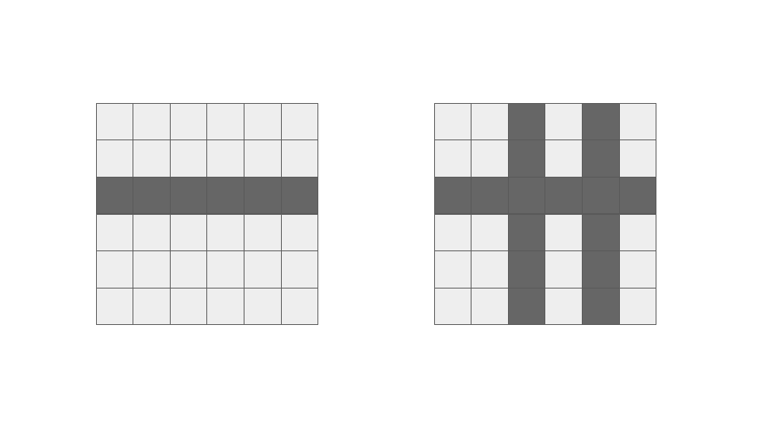

<script type="text/javascript" id="MathJax-script" async src="https://cdn.jsdelivr.net/npm/mathjax@3/es5/tex-chtml.js"></script>

# ABC322 D問題
今回はこちらの問題を解いていきます。

<a href="https://atcoder.jp/contests/abc315/tasks/abc315_d" target="_blank">D - Magical Cookies</a>

## 解説

盤面の状態が次々に変化するため、その度に条件を満たすか判定を行っていたのでは、到底時間内に解くことはできません。

そのため各列、各行の文字の数を管理することによって盤面を変化させるかの判定にかかる計算量を減らすことができます。

盤面が変化する回数は最大で\\(H + W\\)回なので、その内部の判定にかかる計算量を削減することによって十分高速に解くことができます。

### 条件を満たす箇所の判定方法

図を使って説明したいと思います。



それぞれの列や行にはアルファベットの個数をカウントする配列があります。
その時の行、列のサイズをそれぞれ\\(h_c, w_c\\)とします。

以下のような処理を行います。
1. それぞれの行、列の各アルファベットの個数が\\(h_c, w_c\\)と一致する部分をピックアップする。
2. 削除箇所のフラグを立てる。(削除した1行、1列は完全に盤面から消滅するため)
3. 削除する列、行にあるアルファベットのカウントを減少させる。(例えば、3行目にあるCが削除された場合、各列のCのカウントは1減少する)
4. \\(h_c, w_c\\)をディクリメントする。(列、行が減少するため)
5. 1-4を\\(H + W\\)回繰り返したとき、\\(h_c \times w_c\\)がこの問題の解となる。

3の操作を行わない場合、以下のような不具合が考えられます。
- cが5個, dが1個存在する列から、行の削除によりcが1個減る
- 実際はcが4個、dが1個に変化するが、ディクリメントをしないと、cが5個, dが1個のまま
- 結果6から5に変化した\\(h_c\\)とcのカウントが一致し、本来削除対象ではないのに削除される

以下にコードを記載します。
```cpp
int main(){
    int h, w; cin >> h >> w;
    vector<string> data(h); rep(i, h) cin >> data[i];

    vector<vector<int>> row(h, vector<int>(26));
    vector<vector<int>> column(w, vector<int>(26));

    vector<bool> hf(h), wf(w);

    rep(i, h){
        rep(j, w){
            row[i][data[i][j] - 'a']++;
            column[j][data[i][j] - 'a']++;
        }
    }

    int hc = h, wc = w;
    rep(_, h+w){
        // 消せる列の探索
        vector<pair<int, int>> hp, wp;
        rep(i, h){
            if(hf[i]) continue;
            rep(j, 26){
                if(row[i][j] == wc && row[i][j] >= 2){
                    hp.push_back({i, j});
                }
            }
        }
        rep(i, w){
            if(wf[i]) continue;
            rep(j, 26){
                if(column[i][j] == hc && column[i][j] >= 2){
                    wp.push_back({i, j});
                }
            }
        }
        
        // 削除と整理
        for(auto x : hp){
            hf[x.first] = true;
            rep(i, w) column[i][x.second]--;
            hc--;
        }
        for(auto x : wp){
            wf[x.first] = true;
            rep(i, h) row[i][x.second]--;
            wc--;
        }
    }
    cout << hc * wc << endl;
    return 0;
}
```