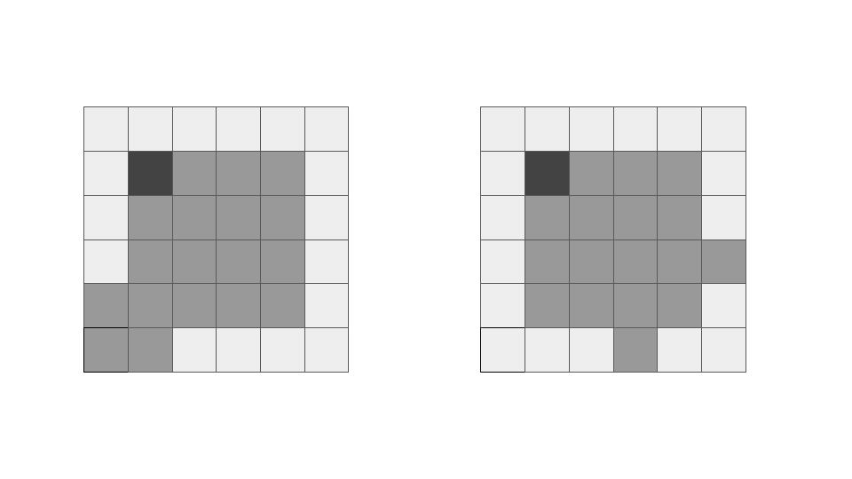

<script type="text/javascript" id="MathJax-script" async src="https://cdn.jsdelivr.net/npm/mathjax@3/es5/tex-chtml.js"></script>

# ABC322 D問題
今回はこちらの問題を解いていきます。

<a href="https://atcoder.jp/contests/abc322/tasks/abc322_d" target="_blank">D - Polyomino</a>

## 解説

ABC307Cの問題を先に解いてから取り組むことをお勧めします。

ABC307Cの問題に回転が入っただけのため、ABC307Cをやっていればそこまで難しくないと思います。

回転の部分を関数にして行うと処理が簡単になります。
今回はaの向きは固定し、b, c合計16種類の回転パターンに関して調査をします。
16回回すループにおいて、bは4回おきに回転し、cは毎回回転するように実装しています。

```cpp
vector<string> rotate(vector<string> s){
    vector<string> tmp(n);
    rep(i, n){
        rep(j, n){
            tmp[i] += s[n-1 - j][i];
        }
    }
    return tmp;
}

bool stamp(vector<string>& ans, vector<string> s, int y, int x){
    rep(i, n){
        rep(j, n){
            if(ans[y+i][x+j] == '#' && s[i][j] == '#') return false;
            if(s[i][j] == '#') ans[y+i][x+j] = s[i][j];
        }
    }
    return true;
}

pair<int, int> point(vector<string>& ans){
    rep(i, 13){
        rep(j, 13){
            if(ans[i][j] == '#'){
                return {i, j};
            }
        }
    }
    return {0, 0};
}

bool check(vector<string>& ans, int y, int x){
    rep(i, n){
        rep(j, n){
            if(ans[y+i][x+j] != '#') return false;
        }
    }
    return true;
}

int main(){
    vector<string> a(n), b(n), c(n);
    rep(i, n) cin >> a[i];
    rep(i, n) cin >> b[i];
    rep(i, n) cin >> c[i];

    int cnt = 0;
    rep(i, n) rep(j, n) if(a[i][j] == '#') cnt++;
    rep(i, n) rep(j, n) if(b[i][j] == '#') cnt++;
    rep(i, n) rep(j, n) if(c[i][j] == '#') cnt++;

    if(cnt != 16){
        cout << "No" << endl;
        return 0;
    }

    for(int i=1; i<=n*n; i++){ // aの盤面を中心とする
        // 軸となる盤面作成
        rep(j, 13){
            rep(k, 13){
                rep(l, 13){
                    rep(m, 13){
                        vector<string> ans(16, "................");
                        stamp(ans, a, 6, 6);
                        if(!stamp(ans, b, j, k)) continue;
                        if(!stamp(ans, c, l, m)) continue;
                        auto v = point(ans);
                        if(check(ans, v.first, v.second)){
                            cout << "Yes" << endl;
                            return 0;
                        }
                    }
                }
            }
        }
        if(i%n == 0) b = rotate(b); //戻り値受けてなかった...
        c = rotate(c);
    }
    cout << "No" << endl;
    return 0;
}
```

それぞれ関数の機能を簡単に解説します。
- rotate : 図形の回転を行います
- stamp : 図形の設置を行います
- point : \\(4 \times 4\\)の探索領域の左上の座標を返します
- check : pointの戻り値が指す座標を起点として、条件を満たすかの判定を行います


今回実装した判定方法では、point関数を使用して左上を発見し、そこを起点に\\(4 \times 4\\)の#のみの領域が存在するかについて判定しているため、図のようなケースが判定漏れになってしまいます。

そのため、#の個数をあらかじめ数えて判定条件に付与しました。

## 切り取る部分を固定する実装

ABC307Cでも書きましたが、aを固定した実装よりも、切り取る部分を固定した実装の方が考えやすいかもしれません。(point関数も必要ないし...)

切り取り部分を固定した実装コードを以下に記述しておきます。
```cpp
const int n = 4;

vector<string> rotate(vector<string> s){
    vector<string> tmp(n);
    rep(i, n){
        rep(j, n){
            tmp[i] += s[n-1 - j][i];
        }
    }
    return tmp;
}

bool stamp(vector<string>& ans, vector<string> s, int y, int x){
    rep(i, n){
        rep(j, n){
            if(ans[y+i][x+j] == '#' && s[i][j] == '#') return false;
            if(s[i][j] == '#') ans[y+i][x+j] = s[i][j];
        }
    }
    return true;
}

bool check(vector<string>& ans, int y, int x){
    rep(i, n){
        rep(j, n){
            if(ans[y+i][x+j] != '#') return false;
        }
    }
    return true;
}

int main(){
    vector<string> a(n), b(n), c(n);
    rep(i, n) cin >> a[i];
    rep(i, n) cin >> b[i];
    rep(i, n) cin >> c[i];

    int cnt = 0;
    rep(i, n) rep(j, n) if(a[i][j] == '#') cnt++;
    rep(i, n) rep(j, n) if(b[i][j] == '#') cnt++;
    rep(i, n) rep(j, n) if(c[i][j] == '#') cnt++;

    if(cnt != 16){
        cout << "No" << endl;
        return 0;
    }

    ll m = 2*n-1; // 探索の幅
    ll cyc = 1;
    rep(i, 6) cyc *= m;

    for(int i=1; i<=n*n; i++){
        rep(j, cyc){
            ll tmp = j;
            vector<int> dig(6);
            // ループの代わりに3, 2, 4, 6, 0, 0のような座標配列を作成する 7進数で管理
            rep(k, 6){
                dig[k] = tmp % m;
                tmp /= m;
            }
            
            // 判定
            vector<string> ans(10, "..........");
            stamp(ans, a, dig[0], dig[1]);
            if(!stamp(ans, b, dig[2], dig[3])) continue;
            if(!stamp(ans, c, dig[4], dig[5])) continue;
            if(check(ans, 3, 3)){
                cout << "Yes" << endl;
                return 0;
            }
        }
        if(i%n == 0) b = rotate(b);
        c = rotate(c);
    }
    cout << "No" << endl;
    return 0;
}
```