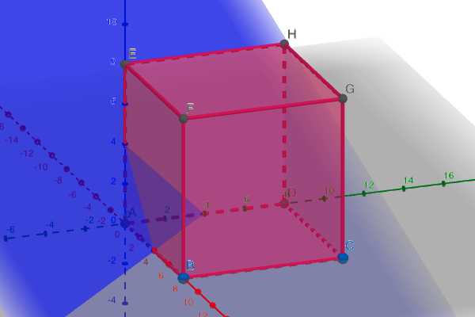

# 条件を満たす3つの自然数の数
## x + y + z = kとなる(x, y, z)の数について (0 ≦ x, y, z, ≦ N)

書き忘れていましたが、0 ≦ k ≦ 3Nとして考えています。

この問題はx, y, zの上限に関する制約がないと非常に簡単です。

高校で学習するk個のボールと2個の仕切りの考えを利用して次の式で解けます。\[x = \frac{(k+2)!}{k!2!}= \frac{1}{2}(k+1)(k+2)\]

しかし、今回のテーマにもあるように制約がある場合、どのように考えるべきでしょうか。

ループを回して数え上げてもいいのですが、その場合の計算量はO(\(N^3\))に比例します。

今回はNが大きい数の場合も想定してO(1)の解法を記述します。

## 三次元空間に存在する、一辺の長さがNの立方体をイメージする

このセクションのタイトルにある通り、一辺の長さがNの立方体をイメージしましょう。

三次元空間におけるx + y + z = kは(1, 1, 1)ベクトルと垂直に交わる平面を表します。 以下の図における青色の平面です。この平面を平面&alpha;と名付けます。

したがって今回は、「立方体を平面&alpha;で切断し、切断面の格子点の数を数え上げよ」という問題に言い換えることができます。

## 切断面の形状による場合分け

切断面は2種類の形状を取ることがあります。正三角形と六角形です。

正三角形の方はイメージしやすいのですが、六角形の方はかなり難しいです。

<video autoplay loop controls src="src/video/v1.mp4" width="50%"></video>

この動画を見るとイメージしやすいと思います。

kは0から大きくすると、k = Nで正三角形から六角形に、k = 2Nで六角形から正三角形に変化します。

したがって、k = N, 2Nを境に場合分けを行います。

## (&#8560;) 0 ≦ k ≦ Nのとき
          

簡潔に説明すると、1からk+1までの総和になります。

条件を満たす解の個数をn(k)とすると以下の式で求めることができます。

\[n(k) = \frac{1}{2}(k+1)(k+2)\]

## (&#8561;) N < k ≦ 2Nのとき

この区間が一番の難所になります。

状況を言葉で表現すると、「傾いた六角形の格子点の数を数え上げよ」となります。響きは最悪です。

しかし、断面図を真上から見た状態をイメージすると、かなり考えやすくなります。

一辺がNの正方形に含まれる格子点の数は\((N + 1)^2\)であるため、そこから2個の直角三角形に含まれる格子点の数を引いていく方針をとります。

左下の直角三角形をV、右上の直角三角形をWとします。 

Vに含まれる格子点の数は、1からk - Nまでの総和です。Wに含まれる格子点の数は1から2N - kまでの総和です。

したがってn(k)は以下の式で表すことができます。

\[\begin{align} 
      n(k) &= (N + 1)^2 - \frac{1}{2}(k - N)(k - N + 1) - \frac{1}{2}(2N - k)(2N - k + 1)\\
           &= -\frac{3}{2}N^2 + \frac{3}{2}N + 1 + k(3N - k)
    \end{align}\]

これは整理する前の式の方が、(全体) - (直角三角形1) - (直角三角形2)といったように理解しやすそうなので、整理する前の式を採用しましょう。

## (&#8562;) 2N < k ≦ 3Nのとき

これも(&#8560;)と同様に考えることができ、1からk - 2N + 1までの総和になります。

したがってn(k)は以下の式で表すことができます。

\[n(k) = \frac{1}{2}(k - 2N + 1)(k - 2N + 2)\]

## 結論

(&#8560;), (&#8561;), (&#8562;)より、題意を満たす解の個数n(k)は以下の式によってO(1)で求めることができます。

\[
    n(k) = \begin{cases}
    \frac{1}{2}(k+1)(k+2) & 0 ≦ k ≦ N \\
    (N + 1)^2 - \frac{1}{2}(k - N)(k - N + 1) - \frac{1}{2}(2N - k)(2N - k + 1) & N < k ≦ 2N \\
    \frac{1}{2}(k - 2N + 1)(k - 2N + 2) & 2N < k ≦ 3N
    \end{cases}
    \] 

## 最後に
          

格子点を数え上げるアプローチとしては今回の方法以外にも、x + y + z = kを満たす非負整数解を表す正三角形から立方体の外にはみ出た領域を引く方法などがあります。 (この解法の便利なところは、引く領域3箇所が全て同じ大きさの正三角形になる点)

格子点数え上げの以外のアプローチとしては、x + y + z = kを満たすためには、x + yの値がk - Nからkの範囲に存在する必要があるという考えに基づいた動的計画法を利用したものがあります。 (愚直な実装でO(\(N\))、工夫した実装でO(\(N^2)\))

<a href="https://atcoder.jp/contests/abc200/editorial/1247" target="_blank">
&#9830; 動的計画法を利用したアプローチ
</a>

<a href="https://atcoder.jp/contests/abc200/tasks/abc200_e" target="_blank">
&#9658; 記事のきっかけになった問題(AtCoder 200 E)
</a>
