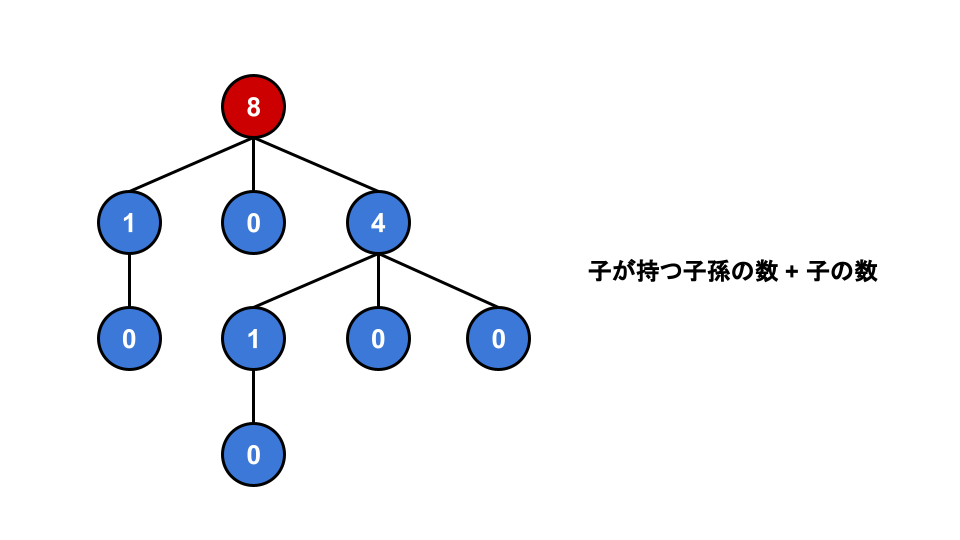
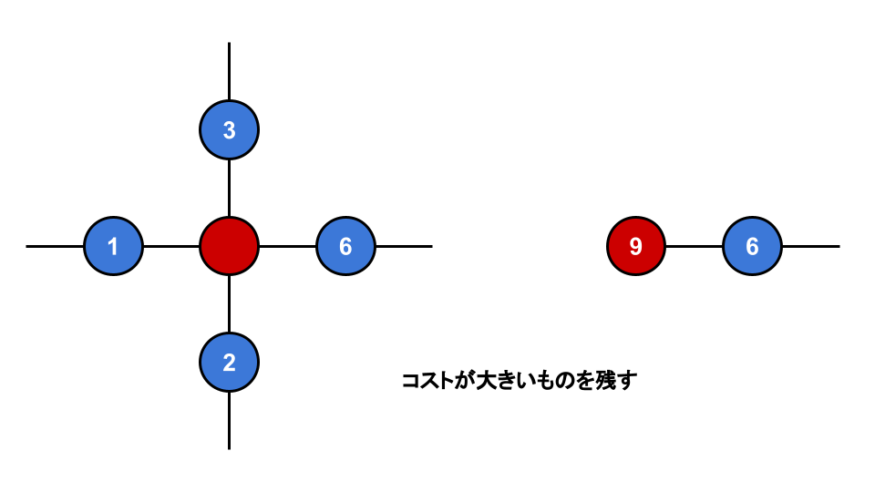
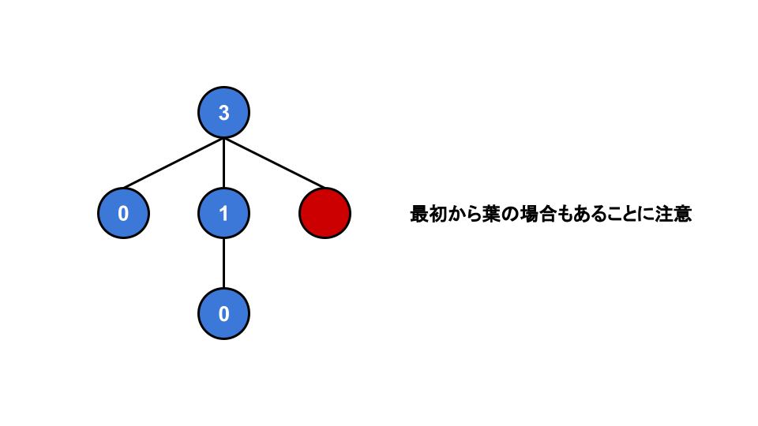

<script type="text/javascript" id="MathJax-script" async src="https://cdn.jsdelivr.net/npm/mathjax@3/es5/tex-chtml.js"></script>

# ABC333

忘年会があったので、バーチャル参加です。(5AC, 3WA)

## A問題

to_string使ってループ回して終わり

## B問題

'A'を引くことにより頂点を数字として扱うことができる。

0-1の距離は0-4の距離と等しく、0-2の距離は0-3の距離と等しいことに着目と判定が一気に楽になる。

3以上の時は5から引いて更新するようにした。(組み合わせみたく小さい方の数字を使用するイメージ)

3 >= とするはずが、3 > とミスったためWA。(なにしてる)

## C問題

レピュニットは12桁までしか必要ないことが分かるため、全探索で加算してsetにどんどんinsertしていき、n番目の要素を出力すれば良いです。

### コード

```cpp
int main(){
    int n; cin >> n;
    ll dat[] = {1, 11, 111, 1111, 11111, 111111, 1111111, 11111111, 111111111, 1111111111, 11111111111, 111111111111};

    set<ll> st;
    int m = 12;
    rep(i, m){
        rep(j, m){
            rep(k, m){
                st.insert(dat[i] + dat[j] + dat[k]);
            }
        }
    }
    auto it = st.begin();
    advance(it, n - 1);
    cout << *it << endl;
    return 0;
}
```

## D問題

1をルートとした場合の子孫の人数を数える。dfsを使用。



ルートノードの子が持つ子孫の数 + 1はそのまま、葉からルートノードに辿りつくためのコストになる。



最小回数でルートノードを葉にするためには、コストが最も大きいノードを残せば良い。



### WAをした理由

dfsを使用した際に、頂点1をルートとして問題を解いたが、ルートのフラグの変更を忘れたため。

フラグのミスに気づき変更を追加、さらに最初から葉の場合の条件を追加した直後にAC。

このとき、フラグミスの変更を忘れていたため、バーチャルコンテスト中は最初から葉のときの条件をつけ忘れたからWAしたのではないかと勘違いしていたが、原因は前者であった。

### コード

```cpp
int dfs(vector<bool>& flag, Graph& g, int v, vector<int>& ans){
    for(int x : g[v]){
        if(!flag[x]){
            flag[x] = true;
            ans[v] += (dfs(flag, g, x, ans) + 1);
        }
    }
    return ans[v];
}

int main(){
    int n; cin >> n;
    Graph g(n);
    rep(i, n-1){
        int v, u; cin >> v >> u;
        v--, u--;
        g[v].push_back(u);
        g[u].push_back(v);
    }

    vector<bool> flag(n);
    vector<int> ans(n);
    flag[0] = true;
    dfs(flag, g, 0, ans);

    int sum = 0, max = 0;
    for(int x : g[0]){
        sum += (ans[x] + 1);
        chmax(max, ans[x] + 1);
    }
    cout << sum - max + 1 << endl; // +1 で自身の削除
    return 0;
}
```

## E問題

問題を逆から見ると簡単解ける。解放は読んだ瞬間に思いついた。

逆再生する。敵が出現すれば、その番号の敵をインクリメント。その後その敵を倒すためのポーションがあれば拾って、敵をディクリメント。

案件が来た時に、必要とされている案件なら拾うといったイメージ。

最終的に全ての敵に関するカウントが0であれば、全てのモンスターの撃退に成功したということ。

これは最適解の一種なので、最後に前から見て、最もポーションを所持していたときの個数を取得することでAC。

### WAした理由

0-basedでコーディングしたが、問題自体は1-besed。xを受け取った時に、ディクリメントをする必要があった。

今回のWAでは1ケース落ちていたのだが、どのような方法でミスを発見したのかを記しておく。

1. 問題の制約を確認。オーバーフローの可能性がないことを確認。
2. めっちゃ迷った挙句、たまたま問題が1-basedであることに気づく。

オーバーフローと同じくらいやらかしそうなことなので、次からはWAが発生した時は優先的に確認する。

### コード

```cpp
int main(){
    int n; cin >> n;
    vector<int> t(n), x(n); rep(i, n) cin >> t[i] >> x[i];
    rep(i, n) x[i]--;

    /* 逆生成 */
    vector<int> e(n), ans(n);
    for(int i=n-1; i>=0; i--){
        if(t[i] == 2){
            e[x[i]]++;
        }
        else{
            if(e[x[i]] > 0){
                ans[i] = 1;
                e[x[i]]--;
            }
        }
    }

    /* 撃退可能かの判定 */
    bool flag = true;
    rep(i, n) if(e[i] != 0) flag = false;
    if(flag){
        int num = 0;
        int max = 0;
        rep(i, n){
            if(t[i] == 1 && ans[i] == 1) num++;
            else if(t[i] == 2) num--;

            /* ポーションの最適数を取得 */
            chmax(max, num);
        }
        cout << max << endl;

        rep(i, n) if(t[i] == 1) cout << ans[i] << " ";
        cout << endl;
    }
    else cout << -1 << endl;
    return 0;
}
```
