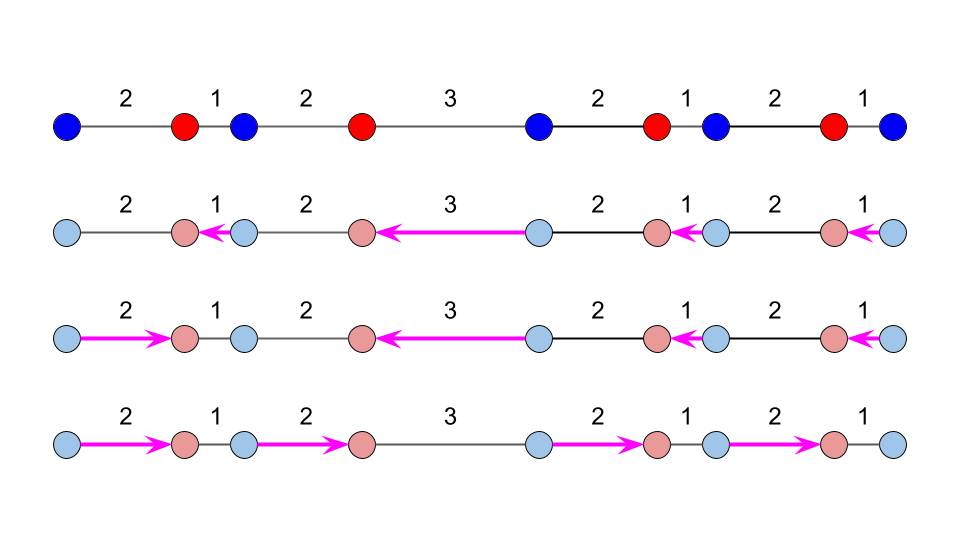

<script type="text/javascript" id="MathJax-script" async src="https://cdn.jsdelivr.net/npm/mathjax@3/es5/tex-chtml.js"></script>

# ABC334

perf 1048 でした。 A, B, C, D 4完です(4AC, 4WA)。

本来なら一瞬で通過したいB問題で永遠に時間を使ってしまいました。自分が曖昧にしている部分だと思うので、少し図を使用してまとめていきたいと思います。

B問題で結構やらかしたが、C問題(30分)、D問題(10分)と立て直したのは評価したいところ。コンテスト後、E問題(diff 1298)を15分程度で解けているので、E問題は難しかったというよりはB, Cあたりで時間を取られて時間不足でdiffが高く出てそう。

結果に一喜一憂せず、コツコツと積み上げていきましょうか。

## A問題

とくに書くことはないです。

## B問題

今回のコンテストにおいて最も苦戦したのがこの問題です。

\\(A + kM\\)に着目するということなので、\\(A\\)が原点になるようにずらせば、\\(L\\)以上\\(R\\)以下の\\(M\\)の倍数の個数を数えろという問題に帰着することができます。

コンテスト中は範囲が正の場合、負の場合、正負をまたぐ場合と場合分けを行って考えましたが、どう考えても効率が悪いため、より良い手法について考察してみます。


要するに範囲内の最も東にある木の番号(kmと表した時のk)と範囲の西側にある木のうち最も東のあるものの番号が分かれば良い。

r以下のmの倍数の最大値と、l未満のmの倍数の最大値を知ることができればよさそう。l未満ということはl-1以下とも考えることができる。

c++では、r, lが正か負かによって剰余が示す部分がことなるため注意が必要。


これを解決するためには\\(((k \% m)+m) \% m\\)とすると良い。

### コード

```cpp
int main(){
    ll a, m, l, r;
    cin >> a >> m >> l >> r;
    
    // mの倍数で考えれるようにする
    l -= a, r -= a;

    // l未満で最大のmの倍数 -> l-1以下で最大のmの倍数、r以下で最大のmの倍数を考える
    ll l_m = (l-1) - ((l-1)%m + m) % m;
    ll r_m = r - (r%m + m) % m;

    cout << r_m/m - l_m/m << endl;
    return 0;
}
```

### コンテスト中にエラーが発生した原因

コンテスト中は剰余を使用して前処理を行った数ではなく、正負の場合分け、かつ/によって切り捨ての演算を行い、それに対して+1するかどうかを判定した。

しかしこれでは割り切れるときに問題が発生することがわかった。(実際に0, 3, 3, 6などのテストケースが落ちていた。)

### k以下のmの倍数のうち、最大のものを返す関数

やらかしすぎたのでテンプレにしておく。

```cpp
template<typename T> T floor_multiple(T k, T m){ return k - ((k%m+m)%m); }
```

## C問題

30分かかりました。

### 思考ログ


まず簡単な考察から始める。以下図では、靴下を選択したときに、先に選んだものを青、後に選んだものを赤と表現する。靴下を点、洗濯を線で結び、グラフっぽく表現してみる。

クロスしないように結ぶことが最適解か？でも図3ではクロスしているものとそうではないもののコストは同値になっている。

- 仮定 : 揃っている靴下はそれをペアとして、除外して良い。


なんか正しそう。証明は時間がないからしない。この仮定のもとに解いていく。

揃っている靴下を除外して思考を始める。


コストが小さいものから貪欲法を用いて考えてみる。しかしこれは図5のときに否定される。

さらに、この図から以下の仮定をする。

- 隣り合った点のみしか結ぶことができない。(点を跨いで結ぶとき、跨いだ点を利用すればより最適になるため。)


この仮定より、揃っていない靴下の枚数が偶数の時はすぐに解が求まる。難しいのは揃っていない靴下の枚数が奇数のとき。

この段階で考えるべき問題は<b>揃っていない靴下の枚数が奇数のとき、選ぶべきではない靴下1個を決定せよ。</b>



ここで、必ず選択する必要がある靴下の存在に気づく必要がある。図7の赤点1個を選択し、それを結ばないようにすると、必ず選択した赤点を跨いでむず部ことになる。これは仮定に反するため最適解となり得ない。

よって解は青点のうちどれか1点を選択しなかった場合に発生する。

選択しない青点を指定してその度にコストの計算をしているとTLEしてしまうが、最初に最左の一点を除き、その後頂点を連鎖的に繋ぎ変えるということをすると、計算を\\(O(N) \\)で終えることができる。これは十分高速である。

青点を有向辺の始点、赤点を有向辺の終点と考えると連鎖反応がイメージしやすい。

### コード

```cpp
int main(){
    int n, k; cin >> n >> k;
    vector<ll> a(k);
    rep(i, k) cin >> a[i];

    ll ans = 0;
    if(k%2 == 0){ // 偶数なら簡単
        rep(i, k){
            if(i%2 == 0){
                ans += (a[i+1]-a[i]);
            }
        }
        cout << ans << endl;
        return 0;
    }
    else{ // 奇数なら難しい
        ll min = infl;
        rep(i, k){
            if(i == 0) continue;
            if(i%2 == 0){
                ans += (a[i]-a[i-1]);
            }
        }
        chmin(min, ans);
        rep(i, k){ // 連鎖的に繋ぎ直す
            if(i == k-1) continue;
            if(i%2 == 0){
                ans += (a[i+1]-a[i]);
                ans -= (a[i+2]-a[i+1]);
                chmin(min, ans);
            }
        }
        cout << min << endl;
    }
    return 0;
}
```
## D問題

この問題は解法が\\(O(1)\\)で思いつきました。貪欲法が成立するため、コストが小さいものから選択すれば良いです。

具体的にはソートして累積和を取ることで、\\(i\\)台のソリを引くために必要な最適なコストを計算することができます。

これによって各クエリに対して\\(O(1)\\)で応答することができます。

### コード

```cpp
int main(){
    ll n, q; cin >> n >> q;
    vector<ll> r(n);
    rep(i, n) cin >> r[i];

    // ソート 累積和
    sort(r.begin(), r.end());
    vector<ll> s(n);
    s[0] = r[0];
    for(int i=1; i<n; i++){
        s[i] = s[i-1] + r[i];
    }

    // クエリ
    rep(i, q){
        ll tmp; cin >> tmp;
        auto it = upper_bound(s.begin(), s.end(), tmp);
        ll d = distance(s.begin(), it);
        cout << d << endl;
    }
    return 0;
}
```

## E問題

これも簡単です。おそらく、前の問題で時間がない人が取り組んでないだけでしょう。

まずはいつも通り連結成分数を求めます。BFSを使用するのですが、連結している文字列にグループ番号を振っておきます。


つぎに.を#に変更したとき、何個のグループと隣り合っているかを確認します。0個のグループと隣り合っている時は、むしろ連結成分数が増えることに注意しましょう。

最終的に解は<b>全パターンの連結成分数の総和をパターン数で割ったものにmodint998244353を適用</b>することで求めることができます。

### コード

```cpp
#include "atcoder/modint.hpp"
using mint = modint998244353;

int main(){
    int h, w; cin >> h >> w;
    vector<string> s(h); rep(i, h) cin >> s[i];

    vector<vector<int>> data(h, vector<int>(w));
    int dy[] = {0, 1, 0, -1}, dx[] = {1, 0, -1, 0};

    int cnt = 0;
    rep(i, h){
        rep(j, w){
            if(s[i][j] == '#' && data[i][j] == 0){
                cnt++;
                queue<pair<int, int>> que;
                que.push({i, j});
                data[i][j] = cnt;
                while(!que.empty()){
                    auto v = que.front(); que.pop();
                    rep(k, 4){
                        if(checker(v.first+dy[k], v.second+dx[k], h, w) && s[v.first+dy[k]][v.second+dx[k]] == '#' && data[v.first+dy[k]][v.second+dx[k]] == 0){
                            que.push({v.first+dy[k], v.second+dx[k]});
                            data[v.first+dy[k]][v.second+dx[k]] = cnt;
                        }
                    }
                }
            }
        }
    }

    int r_cnt = 0;
    mint sum = 0;
    rep(i, h){
        rep(j, w){
            if(s[i][j] == '.'){
                r_cnt++;
                set<int> st;
                rep(k, 4){
                    if(checker(i+dy[k], j+dx[k], h, w)){
                        if(data[i+dy[k]][j+dx[k]] > 0){
                            st.insert(data[i+dy[k]][j+dx[k]]);
                        }
                    }
                }
                if(st.size() == 0) sum += (ll)(cnt + 1); // sizeが0のときは成分1増える
                else sum += (ll)(cnt - st.size() + 1);
            }
        }
    }
    cout << (sum/r_cnt).val() << endl;
    return 0;
}
```

### 追記 : コード修正点

条件分岐1行にまとめれます。(可読性は修正前のほうがいいのかな)

```cpp
if(st.size() == 0) sum += (ll)(cnt + 1);
else sum += (ll)(cnt - st.size() + 1);

sum += (ll)(cnt - st.size() + 1);
```