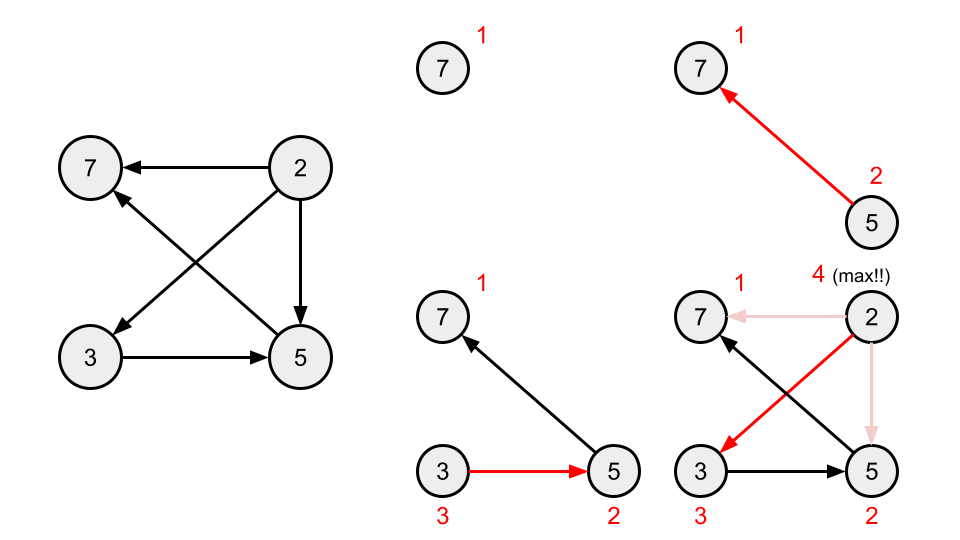
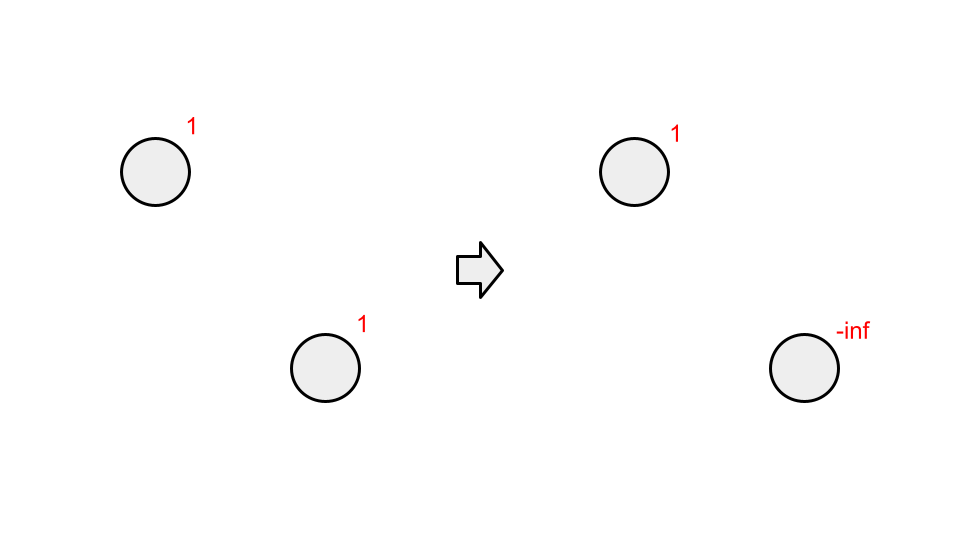

<script type="text/javascript" id="MathJax-script" async src="https://cdn.jsdelivr.net/npm/mathjax@3/es5/tex-chtml.js"></script>

# ABC335

perf 1021 でした。 A, B, C, D 4完です(4AC, 1WA)。

やはり変なミスで時間を使ってしまいました。E問題がかなり難しかったですが、正直あと少しだったので、考察力はついてきていると思います。

## A, B問題

特に書くことはないです。

## C問題

自分の解法は、尻尾がある部分に次の頭の位置を代入していけば、龍全身の位置を把握することができます。

移動の度に頭のデータの格納位置が変化することと、それに応じて体のデータの格納位置も変化することの両方を管理することは、少し困難ですが無事ACできました。

4分でわかるA-F解説で紹介されていた頭の位置の履歴を作成するという解法は、わかりやすく高速に実装できて良いと思いました。

## D問題

バグらせて15分くらい無駄にしました。というかD問題難易度どうしたの...

ここでWAしているのですが、これはデバック用の出力を消し忘れたからです。(笑えない)

```cpp
int main(){
    int n; cin >> n;
    int dy[] = {0, 1, 0, -1};
    int dx[] = {1, 0, -1, 0};

    vector<vector<int>> dat(n, vector<int>(n));
    vector<vector<bool>> flag(n, vector<bool>(n));
    dat[(n+1)/2-1][(n+1)/2-1] = -1;
    flag[(n+1)/2-1][(n+1)/2-1] = true;

    int num = 1;
    int clock = 0;
    int y = 0, x = 0;
    rep(i, n*n-1){
        dat[y][x] = num;
        flag[y][x] = true;

        num++;
        while(1){
            if(!checker(y+dy[clock], x+dx[clock], n, n)){
                clock++; clock %= 4;
            }
            else if(flag[y+dy[clock]][x+dx[clock]]){
                clock++; clock %= 4;
            }
            else{
                y += dy[clock], x += dx[clock];
                break;
            }
        }
    }

    /* 出力 */ 
}
```

壁にぶつかったら方向転換!!って実装にしたんですが、安易にwhile(1)を使用した結果、見事にやらかしました。

冷静に対処できれば、どこでエラーが起きているかを判断できたと思うのですが、まだまだですね。

全ての数字を埋めたとき、その周辺は全てtrueのフラグで埋められているため、次の探索箇所を決定することができず無限ループに陥ります。

```cpp
if(i == n*n-2) break;
```

while文の最初に、最後に数字を埋めたときは、強制終了というコードを書けば解決します。または、Tのflagをfalseにしておくとかでしょうか。

どちらにせよ。この問題に時間を使っているようではダメダメですね。

実際には、ぶつかったら右に進路を変更するだけで良いので、whileを使う必要はなく。不必要な実装をして詰んでいたという形になります。

### コード(コンテスト中)

```cpp
int main(){
    int n; cin >> n;
    int dy[] = {0, 1, 0, -1};
    int dx[] = {1, 0, -1, 0};

    vector<vector<int>> dat(n, vector<int>(n));
    vector<vector<bool>> flag(n, vector<bool>(n));
    dat[(n+1)/2-1][(n+1)/2-1] = -1;
    flag[(n+1)/2-1][(n+1)/2-1] = true;

    int num = 1;
    int clock = 0;
    int y = 0, x = 0;
    rep(i, n*n-1){
        dat[y][x] = num;
        flag[y][x] = true;

        num++;
        if(!checker(y+dy[clock], x+dx[clock], n, n)){
            clock++; clock %= 4;
        }
        else if(flag[y+dy[clock]][x+dx[clock]]){
            clock++; clock %= 4;
        }
        y += dy[clock], x += dx[clock];
    }

    rep(i, n){
        rep(j, n){
            if(dat[i][j] == -1) cout << "T" << " ";
            else cout << dat[i][j] << " ";
        }
        cout << endl;
    }
    return 0;
}
```

## E問題

あと少しではあった。最初は普通に問題を読み間違えていた。落ち着いて。

グラフを作成するときに、広義単調増加になるような有向辺のみを張るようにするという発想は良かった。

最初、問題を広義単調増加になるような単純パスのうち最大経路長はいくつかという問題を読みまちがえたため、スコアが大きい頂点から順にグラフに追加していく手法を考えた。



頂点を追加する際に、全ての有向辺が示す頂点をチェックして、最大値+1を自身を始点としたときの、最大経路長とする方法だ。

このアプローチでは同じスコアの頂点の扱いが問題になるが、同じスコアの場合は同一頂点として圧縮してしまおうと考えた。(いいね!!)

ここで、問題を読み間違えていたことに気づく。1からNなのか。なんかより簡単になったのでは??

1からNに遷移可能なとき、Nを始点とする最大経路長 - 1を始点とする最大経路長 + 1が解であると考えた。

しかしこれはWAとなる。理由は、1を始点とする最大経路長において、Nを通ることが保証されないためである。

これを解決することができずに終わってしまった。

### 改善案

コンテスト後に別の手法を利用して、ACできたのだが、コンテスト中に使用した手法を少し改造することでACできるのではないかと、この反省を書いている途中に思った。



最初、問題を広義単調増加になるような単純パスのうち最大経路長はいくつかという問題を考えていたため、その頂点が終点の場合、最大経路長は1ですのように扱っていた。しかし、この操作は終点を複数作るという操作であり、この方針では問題を解決することができなかった。

そのため、終点がNの場合は1を与え、それ以外の頂点が終点になる場合-infの最低評価を与えることによって、終点をNと固定した時の最大経路長を求めることができるようになる。

この初期状態において、前述のスコアが高い頂点からグラフを作る操作を行うことによって、頂点iから終点Nに遷移するときの最大経路長を求めることができる。

最終的に頂点1に記録された最大経路長が正ならそれが解であり、そうでない場合は1からNに到達不可と判定することができる。

Union Findによって頂点圧縮を行っていることに注意すること。

### コード

```cpp
int main(){
    int n, m; cin >> n >> m;
    vector<ll> a(n); rep(i, n) cin >> a[i];
    Graph f(n);
    UnionFind uf(n);
    vector<int> u(m), v(m); rep(i, m) cin >> u[i] >> v[i], u[i]--, v[i]--;

    rep(i, m) if(a[u[i]] == a[v[i]]) uf.merge(u[i], v[i]);

    rep(i, m){
        if(a[u[i]] < a[v[i]]) f[uf.find(u[i])].push_back(uf.find(v[i]));
        if(a[v[i]] < a[u[i]]) f[uf.find(v[i])].push_back(uf.find(u[i]));
    }

    vector<pair<ll, ll>> b(n);
    rep(i, n) b[i].first = a[i], b[i].second = i;
    sort(b.begin(), b.end(), greater<pair<ll, ll>>());
    
    vector<int> cnt(n, -inf);
    cnt[uf.find(n-1)] = 1;
    rep(i, n){
        int v = uf.find(b[i].second);
        for(int x : f[v]){
            x = uf.find(x);
            chmax(cnt[v], cnt[x]+1);
        }
    }
    cout << (cnt[uf.find(0)] > 0 ? cnt[uf.find(0)] : 0) << endl;
    return 0;
}
```

### 別解

公式解答ですが、本当に考え方はほとんど同じです。

この問題のポイントとしては、

- スコアによって遷移に制限をかけたグラフを作成することができるか
- 同じスコアの頂点が連結している場合、頂点を圧縮してもよいことに気づけるか
- 頂点圧縮を後のグラフはDAGになるということに気付けるか

だと思っています。

そして、DAGを見つけてからのアプローチが少し異なり、先ほどは頂点を追加することでゴールからの逆算を行ったのに対し、公式解説では始点1から考えています。

どちらも考え方は同じです。

### コードと考察

```cpp
int main(){
    int n, m; cin >> n >> m;
    vector<int> a(n); rep(i, n) cin >> a[i];
    Graph f(n);

    UnionFind uf(n);
    vector<int> u(m), v(m); rep(i, m) cin >> u[i] >> v[i], u[i]--, v[i]--;

    rep(i, m) if(a[u[i]] == a[v[i]]) uf.merge(u[i], v[i]);

    rep(i, m){
        if(a[u[i]] < a[v[i]]) f[uf.find(u[i])].push_back(uf.find(v[i]));
        if(a[v[i]] < a[u[i]]) f[uf.find(v[i])].push_back(uf.find(u[i]));
    }   
    
    vector<int> dp(n);
    min_priority_queue<pair<int, int>> que;
    vector<bool> flag(n);
    dp[uf.find(0)] = 1;
    que.push({a[uf.find(0)], uf.find(0)});
    while(!que.empty()){
        int v = uf.find(que.top().second); que.pop();
        if(flag[v]) continue;
        flag[v] = true;
        for(int x : f[v]){
            que.push({a[uf.find(x)], uf.find(x)});
            chmax(dp[uf.find(x)], dp[v]+1);
        }
    }
    cout << dp[uf.find(n-1)] << endl;
    return 0;
}
```

発見した頂点のうち、スコアが小さいものから探索するというアルゴリズムなんですが、優先度付きキューを使用しています。

実は最長経路長を初期化するときに、0ではなく-infと非常に小さい数にすることによって、優先度付きキューを使用せずにゴリ押すことができます。

今回の探索は発見の有無に関わらず、スコアが小さい頂点から探索しても問題ないです。

理由は、ある頂点を調べたとき、その頂点が頂点1からの経路を持つのであれば、DAGの性質より自身の祖先が探索済みであることが保証されるためです。

今回は頂点1に1という経路長を示す数字を与えるため、0で初期化していると、全く関係ない部分の最長経路長を拾ってしまう可能性があります。

絶対に埋まらない差をつけた数で初期化をしておきましょう。

```cpp
int main(){
    int n, m; cin >> n >> m;
    vector<int> a(n); rep(i, n) cin >> a[i];
    Graph f(n);

    UnionFind uf(n);
    vector<int> u(m), v(m); rep(i, m) cin >> u[i] >> v[i], u[i]--, v[i]--;

    rep(i, m) if(a[u[i]] == a[v[i]]) uf.merge(u[i], v[i]);

    rep(i, m){
        if(a[u[i]] < a[v[i]]) f[uf.find(u[i])].push_back(uf.find(v[i]));
        if(a[v[i]] < a[u[i]]) f[uf.find(v[i])].push_back(uf.find(u[i]));
    }

    vector<pair<int, int>> b(n);
    rep(i, n) b[i] = {a[i], i};
    sort(b.begin(), b.end());    
    
    vector<int> dp(n, -inf);
    dp[uf.find(0)] = 1;
    rep(i, n){
        for(int x : f[uf.find(b[i].second)]){
            x = uf.find(x);
            chmax(dp[x], dp[uf.find(b[i].second)] + 1);
        }
    }
    cout << max(0, dp[uf.find(n-1)]) << endl;
    return 0;
}
```

現状自分の実力と、この問題の難易度には大差はないです。数ヶ月前と比較すると飛躍的に実力がついています。