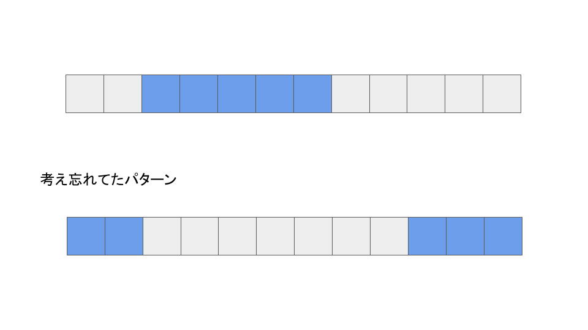
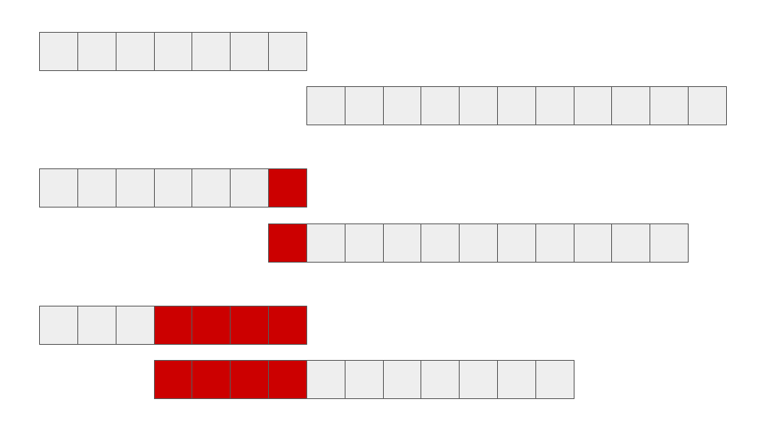
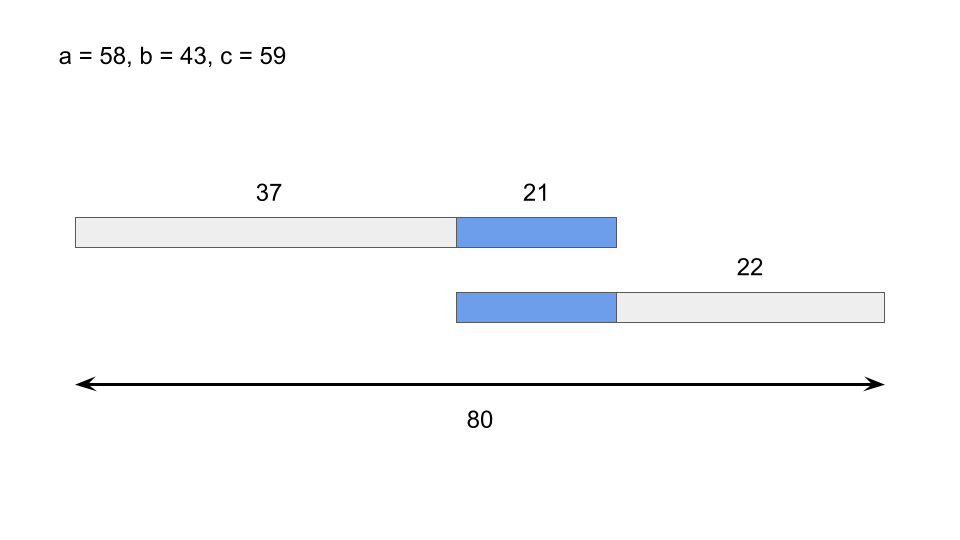
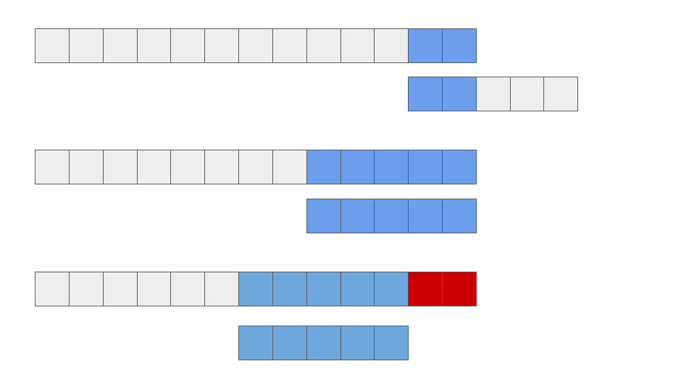
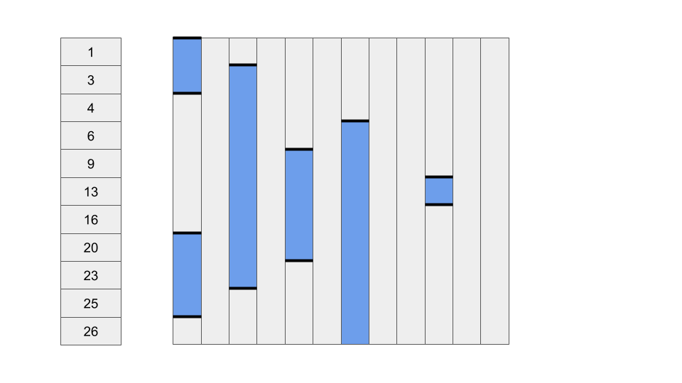

# ABC339

perf 970 3完でした(3AC, 4WA)。しばらく海外にいるのですが、時差の影響で早朝にコンテストに参加しています。早朝の参加は結構しんどいです。

今回3完と結構ひどい成績を取ってしまったのですが、アプローチを思いつくまでの時間はかなり早くなってきていて確かに実力はついているんだろうなという感じです。

D問題の制約を1個つけ忘れたため、通すことができなかったという結果なのですが、今後2点気をつけたいと思います。

- E問題はすぐ解ける問題だったため、飛ばす飛ばさないの判断をしっかりする。
- 解の制約をもう少し吟味する(最近は雑だな思うことが多い)。

D問題も5WAだったので、次にいくかの判断が結構難しかったんですよね。まぁ今後に繋がる失敗回なのではないかなと思います。

## C問題

A, B問題に関しては特に書くこともないので、C問題から以下に思考ログを記載します。

modを使用して簡単にしてしまえばいいだろう。

その日数の幅が題意の期間に収まるかどうかを判定するだけで良さそう。

なんか簡単だなーと思って提出。WA。

原因を突き止めるのに10分くらいはかかったと思う。

### 原因

図で示したように左端と右端が繋がっていることを考慮し忘れていたため、ケースを落とすことに繋がった。

実はこのミスで落としたのは1ケースなのですが...もっと落ちていいでしょ。結構重大なミスだよこれ...

## D問題

C問題で結構時間を使用して焦ったのか、D問題では十分に条件を吟味せずに実装してしまいました。それが結果として最悪の結果を招いてしまいました(ちなみに、C問題のACタイムは結構速かったらしい)。

XOR関係の問題はあまり経験がなく、正直苦手意識があったので今回挑戦できたのは良かったです。

ブロック数は1の個数を表現しています。このようにa, bの1をぶつけて相殺することで1のcの1の個数を減らしていき、条件を満たすことができるかを探索します。

a, bの1が1箇所もぶつかっていない時、全体で1の個数はa + b個です。

しかし、1箇所で衝突しているとき、全体で1の個数はa + b - 2個になります。

その後も衝突の箇所が増えるにつれ、2ずつ減っていくことから、再現不可能な条件が存在するということは容易に想像できます。

今回はこのあとすぐに実装に入ってしまったのですが、もう少し吟味するべき制約が2個ほどありました。

そのうちの2個目の条件を完全に考慮していなかったため、今回はACを取ることができませんでした。

### 制約1(コンテスト中に修正したもの)

この制約を忘れることによって1ケース落ちます。

図2のような状態の時です。a, b, cそれぞれの1の個数が大きい場合はこのようなパターンが発生する可能性があります。

今回の実装では1の個数をa + bから-2ずつ引いていき、cの個数になるかということを探索しました。

cのbit条件は満たすが、実際の数としては制約を満たさないといった解を求めていることがありました。

### 制約2

この条件を忘れていたため、今回のコンテストは大失敗してしまいました。

a, bのうち1の個数が大きい方が小さい方を完全に飲み込んでしまったとき、その後の終了判定を書いていませんでした。

そのため実際には1を相殺できていないが、相殺判定が入ってしまい、不適な解を出力してしまいました。

最近は条件整理を適当にやりすぎているので、気を引き締めたいです。

## E問題

コンテスト後に解きました。一応diffは水色が付いているのですが、簡単でした。(おそらくC, Dでこけた人が多かったため高く算出されているのかな)

このパターンの問題の時は、状態が変わった箇所のみに着目して、計算することで制限時間内に計算を終わらせることが可能となります。

累積和と集合内に出入りしたタイミングを記録するというポイントを抑えることで解くことができます。

### one point

集合に入ったまま、クエリが終了した場合、タイミングが記録されません。この場合、その要素の位置における記録されたタイミングの個数が奇数になります。

そのため、奇数の場合は最後の更新から最後まで集合に含まれ続けたということがわかり、タイミングによる集計時に最後の時刻(q-1)を加算することによってタイミングの記録が偶数であることを保証できます。

集計にかかる時間はループ構造的に一見\\(O(NQ)\\)に見えますが、実際は\\(O(Q)\\)です。

累積和の状態数はqではなくq+1なので、扱いに気をつけましょう。

## 感想

寝ぼけてますね