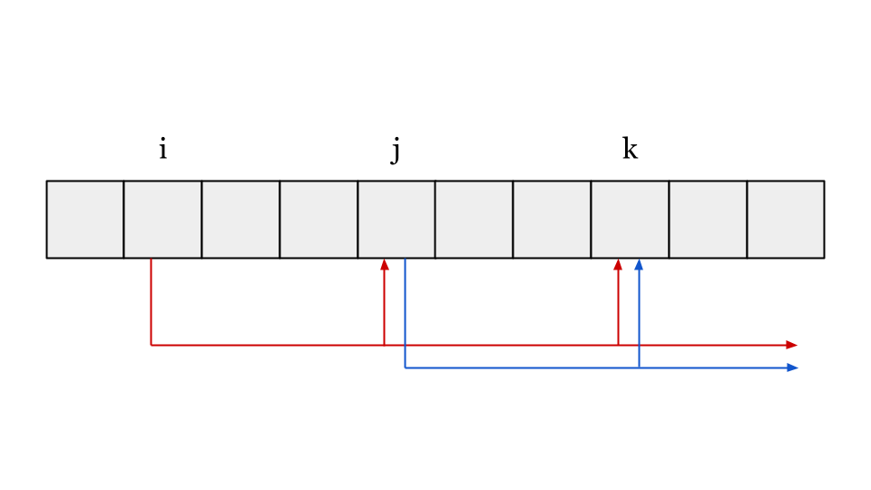

# ABC335 F問題

diff 1690の問題です。DPに一工夫必要なこの問題。初見では厳しいですが、一度理解するとすごく面白い良問です。

## 思考ログ

DPであることは自明である。今回は配るDPで考えると良いだろう。

最初のイメージはこんな感じ。\\(A_i\\)が大きいと配る先が少なくなるため、高速に動作しそう。

しかし、問題は\\(A_i\\)が小さい時。配る処理で最悪\\(O(N)\\)かかってしまい、全体の動作は\\(O(N^2)\\)になりTLEしてしまう。

つまり、今回は配るDPを考える際に\\(O(1), O(logN)\\)の処理を考える必要がありそう。(実際には\\(O(\sqrt(N)\\))でも間に合う。この時点で敗北していたのだ。)

図2のような時の\\(i, j, k\\)にはどのような関係があるだろうか。

\\(i\\)から\\(j, k\\)を見たとき、\\(i, j, k\\)を\\(A_i\\)で割ったあまりが一致する。

これがまず、重要なポイントの1点目になりそう。

次に、