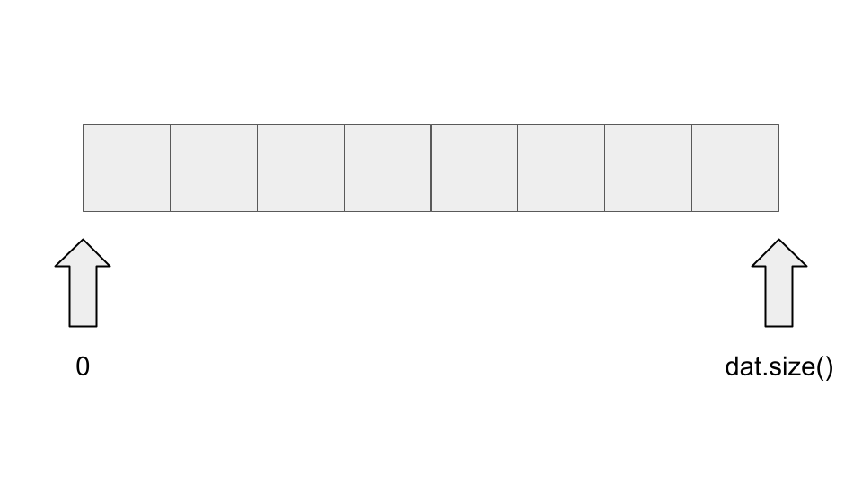

<script type="text/javascript" id="MathJax-script" async src="https://cdn.jsdelivr.net/npm/mathjax@3/es5/tex-chtml.js"></script>

# 二分探索

標準ライブラリではなく、自分で二分探索を実現したい場合に向けて少しだけ書いておく。

二分探索の場合、左端と右端をしていする必要がある。datというソート済み配列があった場合、[0, (int)dat.size())のように半区間で考える。



## 等号の有無

[a, b)の半区間としているため、左端lが最終的に知りたい要素の位置を示すようにする。

そのためlの方に統合を設定する。

## コード

```cpp
vector<int> dat = {1, 2, 4, 6, 24, 35, 46, 88};
int l = 0, r = (int)dat.size();
int target = 46;
while(l+1 < r){
    int v = (l+r)/2;
    if(dat[v] <= target) l = v;
    else r = v;
}
cout << l << " : " << dat[l] << endl;
```

## 実験

### [0, (int)dat.size()-1]の閉区間

```cpp
vector<int> dat = {1, 2, 4, 6, 24, 35, 46, 88};
int l = 0, r = (int)dat.size()-1; // -1する
int target = 46;
while(l+1 < r){
    int v = (l+r)/2;
    if(dat[v] <= target) l = v;
    else r = v;
}
cout << l << " : " << dat[l] << endl;
```

この場合、基本的には上手く動作するが次の場合に破綻する。

```cpp
int target = 88;
```

これはrの存在が邪魔になり、lがそれ以上右に行けなくなるイメージである。

### 閉区間のまま、rを中心に考えてみる

```cpp
vector<int> dat = {1, 2, 4, 6, 24, 35, 46, 88};
int l = 0, r = (int)dat.size()-1;
int target = 46;
while(l+1 < r){
    int v = (l+r)/2;
    if(dat[v] < target) l = v; // 等号をなくす
    else r = v;
}
cout << r << " : " << dat[r] << endl;
```

これで最終的にrに示させることができる。

しかし、これも破綻する場合がある。

```cpp
target = 1;
```

先ほどと同じような理由で、これも正しく動作しない。

### rに位置を示させたいときは??

(-1, (int)dat.size()-1]とすれば正常に動作する。

```cpp
vector<int> dat = {1, 2, 4, 6, 24, 35, 46, 88};
int l = -1, r = (int)dat.size()-1;
int target = 46;
while(l+1 < r){
    int v = (l+r)/2;
    if(dat[v] < target) l = v; // 等号をなくす
    else r = v;
}
cout << r << " : " << dat[r] << endl;
```