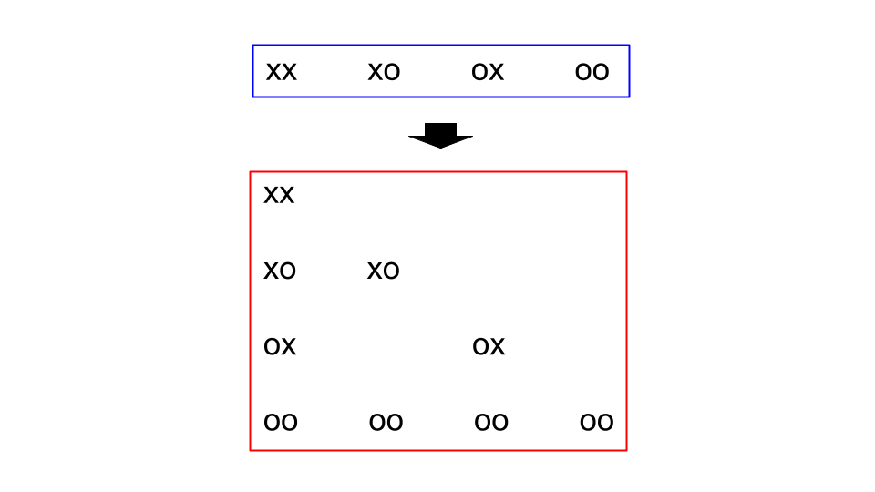

<script type="text/javascript" id="MathJax-script" async src="https://cdn.jsdelivr.net/npm/mathjax@3/es5/tex-chtml.js"></script>

# トリボナッチ数列

コーディングの問題を解いているときに面白い問題を見つけたため、まとめる。

## 問題設定

ある会社には非常に長い作業机があり、その机では複数人が作業を行っている。

ある日から、感染症対策を行うために、3人以上並んで座ることを禁止するという社内ルールを作成した。

3人以上ならんで作業している人がいる場合は、3人以上並んでいるような箇所がないように社員を帰宅させることができる。

作業によって席が埋まっている状態をx、空席状態をoというように表現した文字列が与えられたとき、社員を帰宅させる方法は何通りか。(社員を返さないという選択も1通りとしてカウントする。)

解答例
- xxo : 4通り
- xoxx : 8通り
- xxx : 7通り
- xxxx : 13通り

## 思考ログ

DPでいけそう。席の右端の状態をxx, xo, ox, ooに分けて遷移状態を考えると結構いい感じになるのでは。

悪くないが、状況の整理がいまいちできていない。図を書いて結構いい感じ、いけそう。

なぜかテストケースを通すことができない。理由はなんだろうか。原因不明。手法変更。(実は初期状態において初期値を逆に与えていた。)

xoxx, xooxx, xoooxxこれら全て同じ答えになる。つまり、xの間に入るoの個数は解に影響を与えない。

oは区切りの役割を果たす。つまりxが何個連続しているか、そしてそれが何個あるかが重要。

連続するxの規則性はなんだろう。2, 4, 7, 13でとりあえず、<a href="https://oeis.org/?language=japanese" target="_blank">オンライン整数列大辞典</a>にぶち込んでみよう。

結果 : トリボナッチ数列

テストケースを全部通すことに成功。

## 別解(DP解)

i文字目までみた時の右の2文字がxx, xo, ox, ooである、のように4種類に場合分けをして考えていく。

i文字目がxだった場合、xのままのパターンとその場所に座っている社員を帰宅させoに変換する。2パターンを考える。

- ...xoにoが来た場合は、ooに遷移する。
- ...oxにxが来た場合は、xxやxoに遷移する。

これらの遷移をまとめると、以下の図のようになる。


- xxのときにxを見たとしても、xxxはルール違反になるため、遷移することができない。これに注意する。

### DPの初期条件

1, 2文字目の状態によって初期状態が決定される。

- xx : xx, xo, ox, ooを1とする。それ以外は0。
- xo : xo, ooを1とする。それ以外は0。
- ox : ox, ooを1とする。それ以外は0。
- oo : ooを1とする。それ以外は0。

## 2文字ごとに見ていく方法(DP 2文字ver.)


図2のように3文字ごとの遷移を考えることもできるのではと思ったが、あまりにも遷移が複雑なので、なんだかなと...

図2を作成しているうちに、2文字ずつで良くないかと思った。

仮に文字数が奇数のときは末尾にoを追加する方針でいこう。


遷移図は図3のようになる。さらに、観測した2文字の変形を以下図4のように考慮することでこの問題を解くことができる。



## コード

### トリボナッチ
```cpp
vector<pair<char,ll>> runlength(string s) {
    int x = s.size();
    vector<pair<char,ll>> res;
    char pre = s[0];
    ll cnt = 1;
    for(int i=1; i<x; i++) {
        if(pre !=s [i]) {
            res.push_back({pre,cnt});
            pre=s[i]; cnt=1;
        } else cnt++;
    }
    res.push_back({pre,cnt});
    return res;
}

int main() {
    string s; cin >> s;
    auto rl = runlength(s);

    // トリボナッチの計算
    vector<ll> tri(3,0);
    tri[2]=1;
    for(int i=3;i<=60;i++) tri.push_back(tri[i-1]+tri[i-2]+tri[i-3]);

    ll ans=1;
    for(auto u : rl) if(u.first == 'x') ans *= tri[u.second+3]; //ずれの修正

    cout << ans << endl;
    return 0;
}
```

### 1文字DP

```cpp
int main(){
    string s; cin >> s;
    int n = (int)s.size();

    vector<vector<long long>> ans(n, vector<long long>(4));
    vector<bool> data(n);
    for(int i=0; i<n; i++){
        if(s[i] == 'o') data[i] = false;
        else data[i] = true;
    }

    // oo, xo, ox, xx
    if(data[0] && data[1]){ // xx
        ans[1][0] = 1LL, ans[1][1] = 1LL, ans[1][2] = 1LL, ans[1][3] = 1LL;
    }
    else if(data[0] && !data[1]){ // xo
        ans[1][0] = 1LL, ans[1][1] = 1LL;
    }
    else if(!data[0] && data[1]){ //ox
        ans[1][0] = 1LL, ans[1][2] = 1LL;
    }
    else if(!data[0] && !data[1]){ //xx
        ans[1][0] = 1LL;
    }

    // oo, xo, ox, xx
    // x, o
    for(int i=2; i<n; i++){
        if(data[i]){
            ans[i][0] = ans[i-1][0] + ans[i-1][1];
            ans[i][1] = ans[i-1][2] + ans[i-1][3];
            ans[i][2] = ans[i-1][0] + ans[i-1][1];
            ans[i][3] = ans[i-1][2];
        }
        else if(!data[i]){
            ans[i][0] = ans[i-1][0] + ans[i-1][1];
            ans[i][1] = ans[i-1][2] + ans[i-1][3];
        }
    }
    cout << ans[n-1][0] + ans[n-1][1] + ans[n-1][2] + ans[n-1][3] << endl;
    return 0;
}
```

### 2文字DP

```cpp
int main() {
    string s; cin >> s;
    if(s.size()%2 != 0) s += "o";

    vector<vector<long long>> ans(s.size()/2, vector<long long>(4)); // oo, ox, xo, xx
    if(s[0] == 'o' && s[1] == 'o') ans[0][0]++;
    else if(s[0] == 'o' && s[1] == 'x') ans[0][0]++, ans[0][1]++;
    else if(s[0] == 'x' && s[1] == 'o') ans[0][0]++, ans[0][2]++;
    else for(int i=0; i<4; i++) ans[0][i]++;
    
    for(int i=1; i<s.size()/2; i++){
        if(s[2*i] == 'o' && s[2*i+1] == 'o'){
            for(int j=0; j<4; j++) ans[i][0] += ans[i-1][j];
        }
        else if(s[2*i] == 'o' && s[2*i+1] == 'x'){
            for(int j=0; j<4; j++) ans[i][0] += ans[i-1][j];
            for(int j=0; j<4; j++) ans[i][1] += ans[i-1][j];
        }
        else if(s[2*i] == 'x' && s[2*i+1] == 'o'){
            for(int j=0; j<4; j++) ans[i][0] += ans[i-1][j];
            for(int j=0; j<3; j++) ans[i][2] += ans[i-1][j];
        }
        else{
            for(int j=0; j<4; j++) ans[i][0] += ans[i-1][j];
            for(int j=0; j<4; j++) ans[i][1] += ans[i-1][j];
            for(int j=0; j<3; j++) ans[i][2] += ans[i-1][j];
            ans[i][3] = ans[i-1][0] + ans[i-1][2];
        }
    }
    long long __ans = 0;
    for(int i=0; i<4; i++) __ans += ans[s.size()/2 - 1][i];
    cout << __ans << endl;
    return 0;
}
```