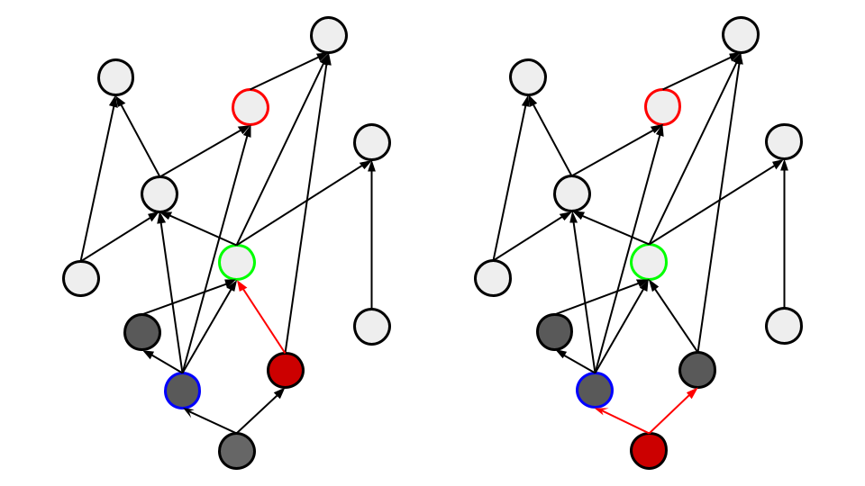

# 最長経路を求める

ABC335 E問題などで使用する、ある始点から終点への最長経路を求めるという話。

最短経路を求めるアルゴリズムは有名で、BFSやダイクストラがあるが、最長経路を求めるアルゴリズムに関する話はあまり有名ではないため、まとめておく。

DAGが与えられていて、頂点の強さがわかっていることを前提とする。

<a href="https://genta23.github.io/docs/AtCoder_v2/contest/abc335.html#e%E5%95%8F%E9%A1%8C" target="_blank">アイデアや実装はこちらを参考にしてください。</a>

ある頂点について考える時、それ以前の頂点は全て探索済みである必要がある。

遷移先に対して、自身の最長経路長+1でアタックをかける。アタックされた方はその中の最大値を採用する。

このように、探索済みでない場合は最適性が保証されない。

求めたい値の更新が後の頂点に伝播できない可能性があるため。

逆にゴールから求めることもできます。この場合は調べたい頂点以降の頂点が探索済みである必要がある。

遷移先の中から経路長の最大値を選択し、+1して自分の最長経路長とする。

DAGから頂点の強さみたいなものを求めるのは、難しそうに思える、一緒に強さ(優先度)のようなものが与えられそう。(ABC335Eでも優先度が与えられている。)

与えられない問題が来たときは、その時考えよう。

## 追記

強さという表現をしていた曖昧なものは、ノードの順序づけのことであり、これは<b>トポロジカルソート</a>という手法によって求めることができるらしい。

実装はこちらを参考にした。

- <a href="https://zenn.dev/reputeless/books/standard-cpp-for-competitive-programming/viewer/topological-sort" target="_blank">トポロジカルソート</a>