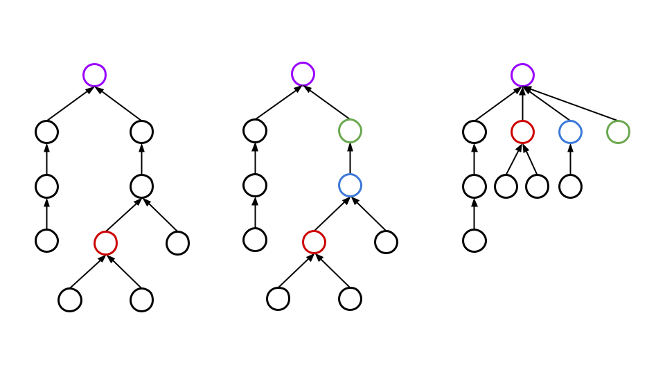
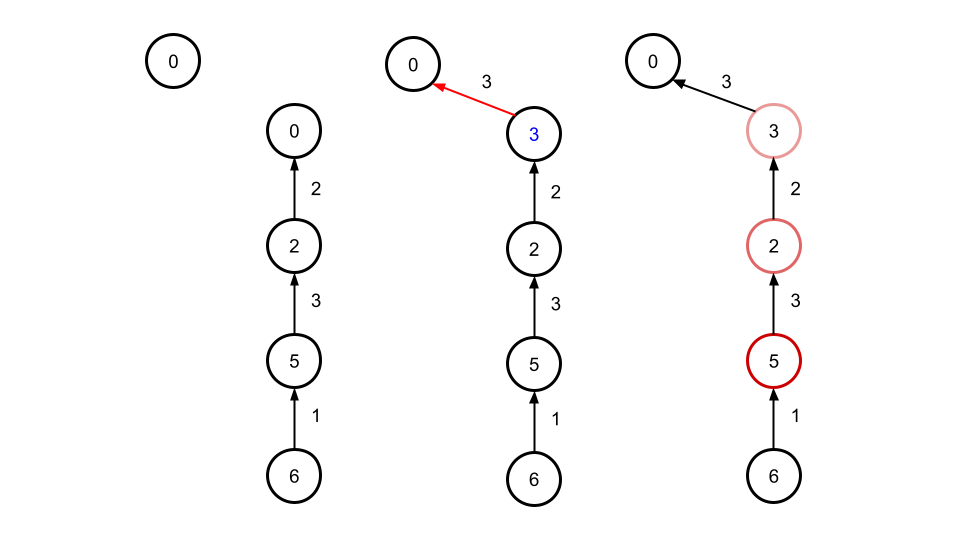
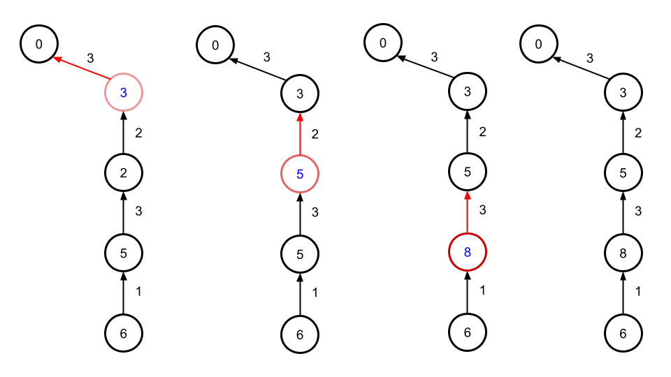
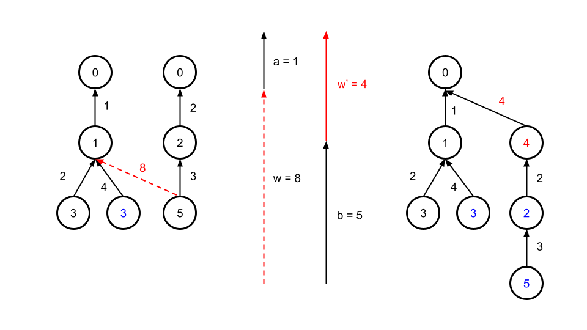

<script type="text/javascript" id="MathJax-script" async src="https://cdn.jsdelivr.net/npm/mathjax@3/es5/tex-chtml.js"></script>

# Union Find

<a href="https://zenn.dev/reputeless/books/standard-cpp-for-competitive-programming/viewer/union-find" target="_blank">Union-Find</a>

このサイトのコードを使用していたのですが、実はUnion Findについてあまり理解していなかったので、勉強しました。

感覚的な説明を書きます。詳しい解説は、上記のサイトを見てください。

## Union Find コード

```cpp
class UnionFind{
public:
    UnionFind() = default;

    explicit UnionFind(size_t n) : m_parents(n), m_sizes(n, 1){
        iota(m_parents.begin(), m_parents.end(), 0);
    }

    int find(int i){ // 再帰関数でルートを特定
        if(m_parents[i] == i) return i;
        return (m_parents[i] = find(m_parents[i])); // 経路圧縮
    }

    void merge(int a, int b){
        a = find(a); b = find(b); // ルートを取得
        if(a != b){
            if(m_sizes[a] < m_sizes[b]) swap(a, b); // swap(a, b)ではポインタの交換が行われている
            m_sizes[a] += m_sizes[b]; // 全てのサイズを変更していると計算時間が増大するので、ルートの情報のみを書き換える
            m_parents[b] = a; // ルートの情報を書き換える
        }
    }

    bool connected(int a, int b) { return (find(a) == find(b)); }

    int size(int i) { return m_sizes[find(i)]; }

private:
    vector<int> m_parents, m_sizes;
};
```

## Union Find 解説

一言で表現すると、グループ化を管理するものです。高速化のために、以下2点の処理を行っています。

- 経路圧縮
- merge tech

### 経路圧縮



赤のノードのルートを探索する際に、ルートまでの経路にある各ノードの親をルートに付け替えることで、以降の探索では非常に高速にルートを発見することが可能になります。

コードではそれを再起的に実現しており、find()にノード番号を入力すると、それがルートノード以外だった場合は親ノードをルートに変更するように実装しています。

### merge tech

木を作成するときに、木の高さが低いグループのルートを高いグループのルートに接続するようにすることで、木が高くなることを防ぎ、計算量を削減します。

merge()ないのswap()の部分でそれを実現しています。(swapはポインタを付け替える処理なので、vector入れ替えなどの操作も\\(O(1)\\)で実現することができます。ABC329 F問題より)

## 重み付きUnion Find コード

```cpp
class UnionFind{
public:
    UnionFind() = default;

    explicit UnionFind(size_t n) : m_parents(n), m_sizes(n, 1), m_weights(n){
        iota(m_parents.begin(), m_parents.end(), 0);
    }

    int find(int i){
        if(m_parents[i] == i) return i;
		int par = find(m_parents[i]);
		m_weights[i] += m_weights[m_parents[i]]; // 累積和
        return (m_parents[i] = par);
    }

    void merge(int a, int b, ll w){
        w += weight(a), w -= weight(b);
        a = find(a), b = find(b);
        if(a != b){
            if(m_sizes[a] < m_sizes[b]) swap(a, b), w = -w;
            m_sizes[a] += m_sizes[b];
            m_weights[b] = w; // m_weights[b] = m_weights[a] + w; ルートは0なので、m_weights[a]は不必要
            m_parents[b] = a;
        }
    }

    bool connected(int a, int b) { return (find(a) == find(b)); }

    int size(int i) { return m_sizes[find(i)]; }

    ll diff(int x, int y) { return weight(x) - weight(y); }

private:
    vector<int> m_parents, m_sizes;
	vector<ll> m_weights;
    ll weight(int x) { find(x); return m_weights[x]; }
};
```

## 重み付きUnion Find 解説

なんかうまくいかなくて実装時間かかったのですが、図を描けば一瞬でした。図を書くことは大事ですね。

Union Findとの違いは、重みを登録する必要があるという点です。

その中で異なる部分が多い、find()とmerge()に着目してみましょう。

### find()

```cpp
int find(int i){
    if(m_parents[i] == i) return i;
	int par = find(m_parents[i]);
	m_weights[i] += m_weights[m_parents[i]]; // 累積和
    return (m_parents[i] = par);
}
```

通常のUnion Findではルートの特定だけで良かったのですが、今回は重みの計算という役割も担っています。



まず、mergeによって木の更新が発生した場合、ルート間の値の更新しか行われません。

find()が使用された際、再起的にルートまでの経路に存在するノードのfind()も呼び出されます。



すると、図3のようにルートに近い順に値の更新が発生し、最初に呼び出しが発生したノードまでの重みを更新することができます。

※ 最初に呼び出しが発生したノードの子ノード以降の値の更新は発生しないことに注意してください(この図では一番下のノード)。

※ 今回は値の更新に着目した図のため、実際には経路圧縮の処理も同時に発生することを忘れないでください。

<strong>※ ノードが持っている値は、自分がルートだと思っているノードの値を0としたときの重み</strong>なので、ルートノードの値が変化した場合は修正する必要がある。ただ、毎回すぐに修正を行う必要はなく、特定のイベントごとに修正を行うことで計算量を抑えることができる。

### merge

```cpp
void merge(int a, int b, ll w){
    w += weight(a), w -= weight(b);
    a = find(a), b = find(b);
    if(a != b){
        if(m_sizes[a] < m_sizes[b]) swap(a, b), w = -w;
        m_sizes[a] += m_sizes[b];
        m_weights[b] = w;
        m_parents[b] = a;
    }
}
```

merge()の難しい点は、重みの調整に関する最初の1行だと思います。



例えば図4左のように2個のノード間の重みが与えられたとき、実際には所属するグループのルート間での接続が行われます。

したがって\\(w'\\)のように、ルート間の重みを計算する必要があり、それを行っているのが最初の1行になります。(これを忘れていて実装ができなく、かなり時間を使ってしましました。)

### その他

weightは基本classの外から呼び出されないのでprivateで定義をしています。

weightを呼び出した際必ず、findを先に使用するのは、計算に使用するノードの値の更新を完了させてから処理を行うためです。(図4の青文字のノードは更新が完了していないもの)

```cpp
// 最初に書いていた処理
m_weights[b] = m_weights[a] + w;

// 現在
m_weights[b] = w;
```

ルート同士のマージを行った際に、最初は上のように書いていたのですが、m_weights[a]が0なことは自明なため、消しました。

重みの与え方、正なのか負なのかという点に関してはもう少し考察の余地がありそう。

今の実装はmerge(a, b, c)とすると、aから見たときbはwだけ大きいという感じなのに対し、diff(a, b)はaはbよりどれだけ大きいかと逆になっている。混乱しそう。これの修正はdiffを書き換えるだけなので簡単だが、どっちの方が感覚的に適しているだろう。とりあえず、逆に実装しているということは頭の片隅に入れておく。