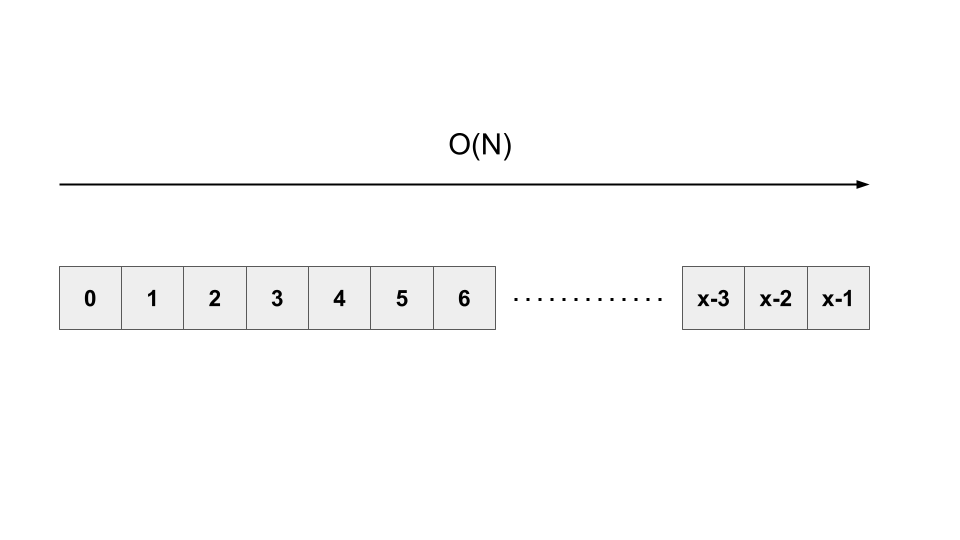
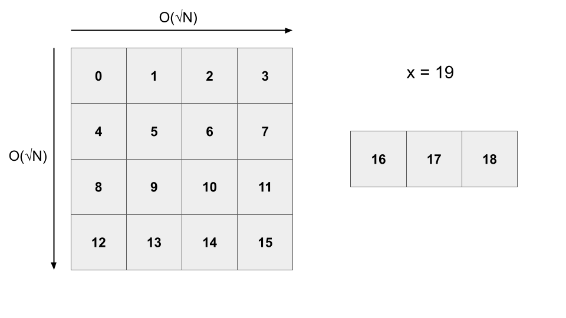

<script type="text/javascript" id="MathJax-script" async src="https://cdn.jsdelivr.net/npm/mathjax@3/es5/tex-chtml.js"></script>

# ABC293 E問題

## 思考ログ

\\(X\\)の制約が非常に大きい。愚直に計算したら絶対TLEするなー。等比数列の和なので、まとめることができそう。

\\[\sum_{i=0}^{X-1} A^i = \frac{A^X - 1}{A - 1}\,(mod\, M)\\]

問題となるのは、\\(A^X\\)をどのように求めるのか。これビット立てるやつだ。(繰り返し二乗法)

ちなみに繰り返し二乗法に関する詳細はこの資料などが分かりやすい。

- <a href="https://hcpc-hokudai.github.io/archive/algorithm_binary_001.pdf" target="_blank">繰り返し2乗法 (バイナリ法)</a>
- <a href="https://algo-logic.info/calc-pow/" target="_blank">繰り返し二乗法によるべき乗(pow(x,n))の計算のアルゴリズム</a>

提出するとRE。REの原因がわからず、敗北。

### REの原因

公式解説にしっかり書かれていた。<b>\\(mod\, M\\)における\\(A-1\\)の逆元が存在するとは限らない</b>ことに注意してください。

<a href="https://qiita.com/drken/items/3b4fdf0a78e7a138cd9a#3-6-%E9%80%86%E5%85%83%E3%81%8C%E5%AD%98%E5%9C%A8%E3%81%99%E3%82%8B%E6%9D%A1%E4%BB%B6" target="_blank">「998244353 で割ったあまり」の求め方を総特集！ 〜 逆元から離散対数まで 〜</a>

こちらの記事が分かりやすかったです。

出題者の罠に見事にハマってしまったような気がします。悔しい！

### コード

```cpp
#include "atcoder/modint.hpp"
using mint = modint;

int main(){
    ll a, x, m; cin >> a >> x >> m;

    /* 等比が1の時のみ例外とする */
    if(a == 1){
        cout << x%m << endl;
        return 0;
    }

    ll tmp = x;
    string x_b;
    while(tmp > 0){
        if(tmp % 2 == 1) x_b += '1';
        else x_b += '0';
        tmp /= 2;
    }

    mint::set_mod(m);
    mint a_x = 1, r = a;
    rep(i, x_b.size()){
        if(x_b[i] == '1') a_x *= r;
        r = r*r;
    }
    cout << ((a_x-1) / (a-1)).val() << endl;
    return 0;
}
```

## 解答例と考察

### 行列漸化式を用いた解法

今の自分では正直思いつかない！！逆元の存在しないことを考慮するくらいなら、漸化式にして行列の計算をすることで、なにかで割るという行為を無くそうという作戦かなぁ。

```cpp
#include "atcoder/modint.hpp"
using mint = modint;

vector<vector<mint>> multi_gyo(vector<vector<mint>> a, vector<vector<mint>> b){
    vector<vector<mint>> c(2, vector<mint>(2));
    c[0][0] = a[0][0]*b[0][0] + a[0][1]*b[1][0];
    c[0][1] = a[0][0]*b[0][1] + a[0][1]*b[1][1];
    c[1][0] = a[1][0]*b[0][0] + a[1][1]*b[1][0];
    c[1][1] = a[1][0]*b[0][1] + a[1][1]*b[1][1];
    return c;
}

int main(){
    ll a, x, m; cin >> a >> x >> m;
    mint::set_mod(m);

    vector<vector<mint>> r(2, vector<mint>(2));
    r[0][0] = a, r[0][1] = 1, r[1][1] = 1;

    /* 繰り返し二乗法 */
    string s;
    while(x > 0){
        if(x % 2 == 1) s += '1';
        else s += '0';
        x /= 2;
    }

    vector<vector<mint>> ans(2, vector<mint>(2)); // 単位元で初期化(単位行列)
    ans[0][0] = 1, ans[1][1] = 1;
    rep(i, s.size()){
        if(s[i] == '1') ans = multi_gyo(ans, r);
        r = multi_gyo(r, r);
    }
    cout << ans[0][1].val() << endl;
    return 0;
}
```

### 平方分割を用いた手法

この手法は思いついてたんですが、等比数列の和を用いる手法に逃げたので試していなかったです。

実装は割とすぐできるような気がします。

```cpp
int main(){
    ll a, x, m; cin >> a >> x >> m;
    ll t = 1; // 床関数 √x を求める
    while(t*t <= x){
        t++;
    }
    t--;

    ll b = 0, r = 1; // 分割パートの計算
    rep(i, t){
        b += r, b %= m;
        r *= a, r %= m;
    }

    ll ans = 0, c = 1; // 分割した計算をさらに繰り返す
    rep(i, t){
        ans += b*c, ans %= m;
        c *= r, c %= m;
    }

    rep(i, x - t*t){ // 残りを計算する
        ans *= a, ans %= m;
        ans++, ans %= m;
    }
    cout << ans << endl;
    return 0;
}
```

この解法はできそうです。行列漸化式の解法が\\(Olog(N)\\)なのに対して、こちらは\\(O(\sqrt{N})\\)なので、若干実行時間が遅いですね。

イメージとしては以下のようになります。

愚直に実装すると\\(O(N)\\)



平方分割によって\\(O(√N)\\)



右側の余った部分を求めるための計算量も\\(O(√N)\\)になります。

行列漸化式までいかなくとも、隣接項の関係性は掴む必要がありそうです。

### ゴリ押す

<b>「剰余の法\\(M\\)と互いに素とは限らない数\\(K\\)で最後に一度だけ除算を行いたい場合、予め途中の計算を全て\\(mod\, MK\\)で行えばよいです。」</b>

ちょっとこれは理解できていません。時間があるときに勉強してみます。これが成立するなら自分が最初に思いついた方法でいけそうです。

しかし、128bit必要になるということで、c++だとなんか必要そう。解答ではpythonなので、pythonなら簡単に表現できるらしいです。