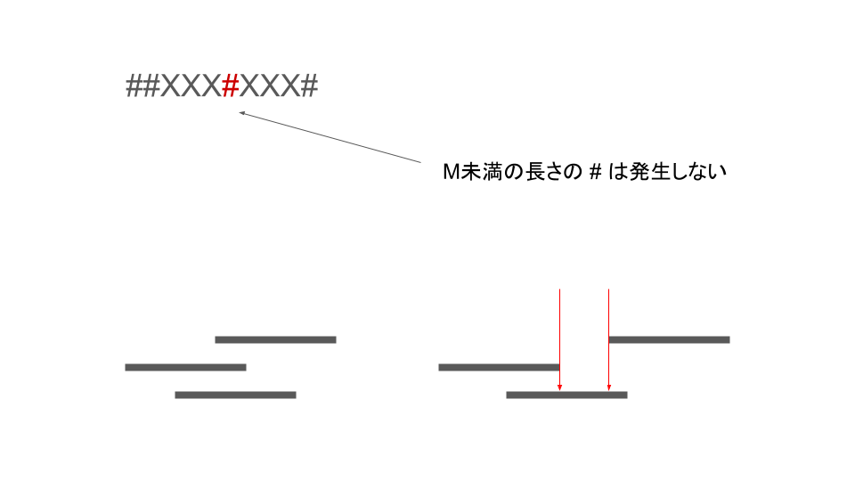
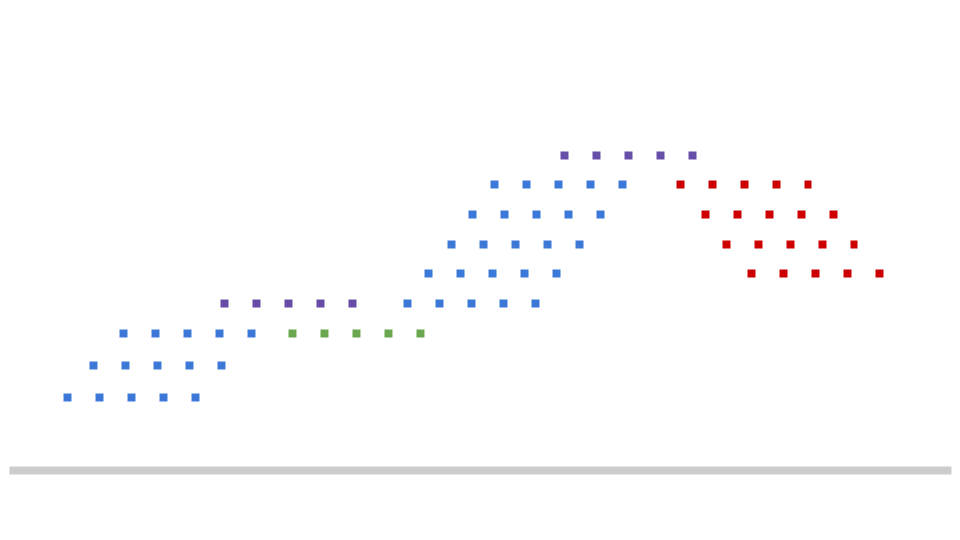

# ABC329 E問題

初見では全くわかりませんでした。何もない状態から目的の文字列を作るのではなく、文字列がある状態から何もない状態に戻せるのかと考えるとのこと。

その発想はなかったーーー。

## イメージ

文字列の変換と聞くと少し難しく感じてしまうが、スタンプを押す問題だと考えると結構解きやすい(タイトルにもありますね)。

スタンプは図1のように重なっている。ここで覚えておきたいのが、同じ場所にスタンプが押されることはないということである。なぜなら、同じ場所に押した場合、前に押したものは全く意味をなさず、なかったものと考えれるためである。

## 起きえない状況

- 同じ場所にスタンプが押される
- M字未満の#が連続した文字列
- 図2の左下のような、あるスタンプを完全に隠すようなスタンプの押し方をする(何もない状況と等価になってしまう)。

## 解法

sから連続したm文字を選び、その文字をs'とする。

このときs'が以下の4状態のとき、いい文字列と判定しs'の全ての文字を#に変換する(少し表現が厳密じゃないのは汲み取って!!)。

- s'とiが完全一致 (紫)
- s'の左が1個以上の連続した#、残り(右)はtと一致 (赤)
- s'の右が1個以上の連続した#、残り(左)はtと一致 (青)
- s'の左が1個以上の連続した#、右が1個以上の連続した#、残り(中央)はtと一致 (緑)

これをいい文字列と判定するためには

- s'のi文字目が、tのi文字目と一致または # である。

という条件を満たすかを判定すれば良い。

ここで頭の片隅に置いておきたのが、この判定だとs'の全てが#の場合も判定が通ってしまうということ。
しかし、判定後の動作がいい文字列なら全てを#に置き換えるというものなので、全く影響がでないためこのパターンを考慮する必要はない。

したがって以下のような方法で簡単に解くことができる。

まずは左から右に文字列をみる。このとき、紫と赤を消すことができる。

次に右から左の文字列をみる。このとき、青と緑を消すことができる。

残ったsに#以外の文字が含まれていればNo、そうでなければYes。

したがって、s, tについて左から調べる実装を行い、s, tの文字列を反転し、同じ処理を行えば良い。

## 感想

s'がtを完全一致の場所を発見したら、その周辺t-1スライドした部分を掘っていく方法やDFSのような手法も提案されていたが、今回紹介した手法が最も実装が簡単で感覚を掴みやすいと思った。

DPを用いた解法も十分面白かったため、少しだけ記録しておこうと思う。

## DPを用いる方法

時間があるときにやる。笑