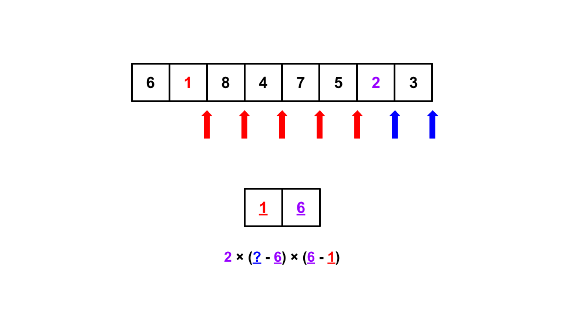

<script type="text/javascript" id="MathJax-script" async src="https://cdn.jsdelivr.net/npm/mathjax@3/es5/tex-chtml.js"></script>

# <a href="https://atcoder.jp/contests/agc005/tasks/agc005_b" target="_blank">AGC005 B問題</a>

AGC005のB問題の発想が面白くて感動したので、簡単にまとめます。

## 思考ログ

区間の選び方は\\(O(N^2)\\)通りあるため、その区間での最小値を求める方法がいくら高速でもTLEになってしまう。

セグメント木をうまく使えば、区間ないの最小値を高速に求めることができそうだが、そもそもの区間の選択の部分で時間がかかりそう。

その後数分思考するも思いつかず。公式動画を見る。

## 解答

### 発想

<u><b>その数が最小値になるような区間の選択方法は何通りあるか</b></u>と考える。


図1のように、着目している数字よりも小さい数字が左または右に出現するまで領域を拡大するイメージ。

これを全ての数字について行えば、解くことができそう。

では、どのように領域の端(赤数字、青数字)を見つけることができるだろうか。

### 領域の端を見つける方法

\\(1, 2,..., N\\)の順で数字に着目していく。そして確認した数字の<u>位置</u>をsetに格納していく。


図2のように、格納位置の前後に格納してある数字が領域の端ということになる。(位置情報にはアンダーバーをつけて対応している。)

この一連の操作は\\(O(logN)\\)で行われることから、全ての数字に対して同様の操作を行い\\(O(NlogN)\\)で計算が完了する。

さらに考察する必要がある事象として、前後に値が存在しないときはどう対応すべきか。

### 前後に値が存在しないとき



図3のような例を想像していただきたい。右の端を発見できず、配列外参照などを引き起こしそうで怖い。

これを防ぐために、setにあらかじめ\\(-1, n\\)を挿入しておくことにした。


図4のようにすることで、どのような場合においても格納した要素の前後に要素が存在することになり、解決。

### その他の懸念点

同じ大きさの数字が存在する場合はどうするのかと思ったが、問題の条件を読むと今回与えられる数列は\\(1, 2,..., N\\)の並び替えであり、このような事象は発生しない。

### コード

```cpp
int main(){
    int n; cin >> n;
    vector<int> a(n); rep(i, n) cin >> a[i];
    
    vector<int> b(n); // i番目に小さい数字が存在する位置を格納する配列
    rep(i, n) b[a[i] - 1] = i;

    set<int> st;
    st.insert(-1);
    st.insert(n);

    ll ans = 0;
    rep(i, n){
        st.insert(b[i]);

        auto itr = st.find(b[i]); // 格納した要素の位置
        auto prev_itr = prev(itr); // 格納した要素の1個前
        auto next_itr = next(itr); // 格納した要素の1個後

        ans += (ll)(i+1) * (*next_itr - *itr) * (*itr - *prev_itr);
    }
    cout << ans << endl;
    return 0;
}
```
