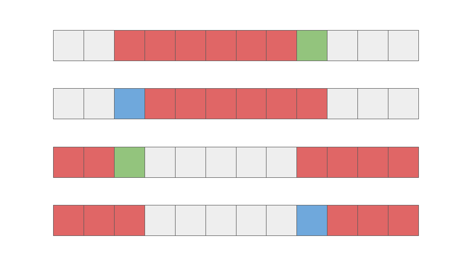

<script type="text/javascript" id="MathJax-script" async src="https://cdn.jsdelivr.net/npm/mathjax@3/es5/tex-chtml.js"></script>

# ABC284 F問題

ローリングハッシュを用いて計算を高速化することでTLEを回避する問題です。

通常のローリングハッシュを使用する場面もありますが、文字列のi文字目のみが変更されるパターンもあり、その場合のハッシュ値の計算をどのように実装するかを考える必要があります。

結局は領域に出入りする要素と、それらの位置のみが重要なため、それさえ理解できれば解くことができます。



上半分はいつものローリングハッシュですが、下半分は領域外になる要素と領域内になる要素の位置(位)が同じなため、実装もそれに応じて変更する必要があります。

## コード

ローリングハッシュの練習として使用したので、ひどいコードになっていますが、(おそらく)今後修正します。

```cpp
#include "atcoder/modint.hpp"
using mint = modint;

mint Hs(string s, vector<mint>& b){
    mint val = 0;
    rep(i, s.size()){
        val += (s[i]-'a'+1)*b[i];
    }
    return val;
}
mint HsSlide(mint v, string& s, int l, int r, vector<mint>& b){
    v *= b[b.size()-2];
    v -= ((s[l]-'a'+1)*b[0]*b[b.size()-2]);
    v += (s[r]-'a'+1);
    return v;
}
mint HsChange(mint v, string& s, int i, vector<mint>& b){
    v += (s[i]-'a'+1)*b[i];
    v -= (s[(int)b.size()+i]-'a'+1)*b[i];
    return v;
}
int main(){
    int n; cin >> n;
    string t; cin >> t;
    const int m1 = 10000007, m2 = 100000007;
    int b = 31;

    /* 10000007 */
    mint::set_mod(m1);
    vector<mint> b1(n), b1_rev(n);
    mint r = 1;
    rep(i, n){
        b1[i] = r;
        b1_rev[i] = r;
        r *= b;
    }
    reverse(b1.begin(), b1.end()); // n, n-1,...,1

    vector<mint> v1(n+1);
    v1[0] = Hs(t.substr(0, n), b1);
    rep(i, n) v1[i+1] = HsSlide(v1[i], t, i, n+i, b1);

    vector<mint> vr1(n+1);
    vr1[0] = Hs(t.substr(n, n), b1_rev);
    rep(i, n) vr1[i+1] = HsChange(vr1[i], t, i, b1_rev);

    /* 100000007 */
    mint::set_mod(m2);
    vector<mint> b2(n), b2_rev(n);
    r = 1;
    rep(i, n){
        b2[i] = r;
        b2_rev[i] = r;
        r *= b;
    }
    reverse(b2.begin(), b2.end()); // n, n-1,...,1

    vector<mint> v2(n+1);
    v2[0] = Hs(t.substr(0, n), b2);
    rep(i, n) v2[i+1] = HsSlide(v2[i], t, i, n+i, b2);

    vector<mint> vr2(n+1);
    vr2[0] = Hs(t.substr(n, n), b2_rev);
    rep(i, n) vr2[i+1] = HsChange(vr2[i], t, i, b2_rev);

    /* 解の判定 */
    rep(i, n+1){
        if(v1[i] == vr1[i] && v2[i] == vr2[i]){
            string ans = t.substr(i, n);
            reverse(ans.begin(), ans.end());
            cout << ans << endl;
            cout << i << endl;
            return 0;
        }
    }
    cout << -1 << endl;
    return 0;
}
```

## 発生した問題

### TLE

stringを参照渡しではなく、値渡しにしていたので、TLEしてしまった。

stringを値渡しするのにかかる計算量は\\(O(1)\\)ではなく、\\(O(N)\\)である。

### WA

stringを参照渡しにするついでに値も参照渡しに変更してしまった。

v[i]の値を元にv[i+1]の値を計算する予定が、ガッツリv[i]の値も変更してしまった。

変更する必要がある値の場合、参照にするか値にするか気を付ける必要がありますね。