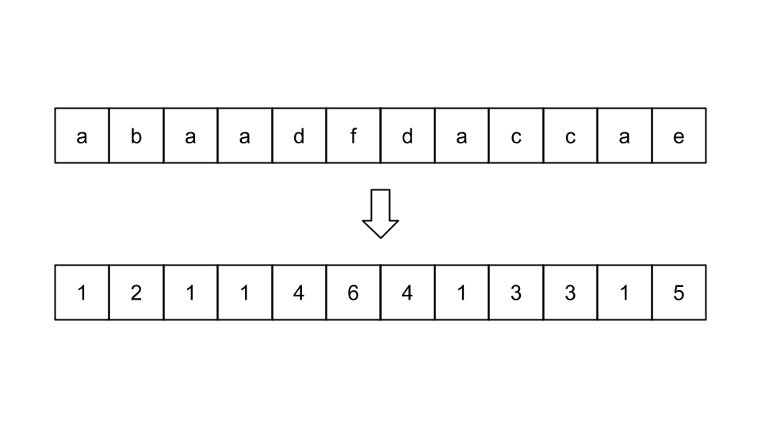
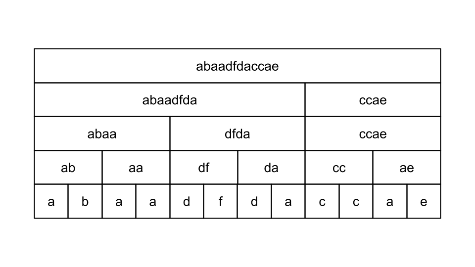
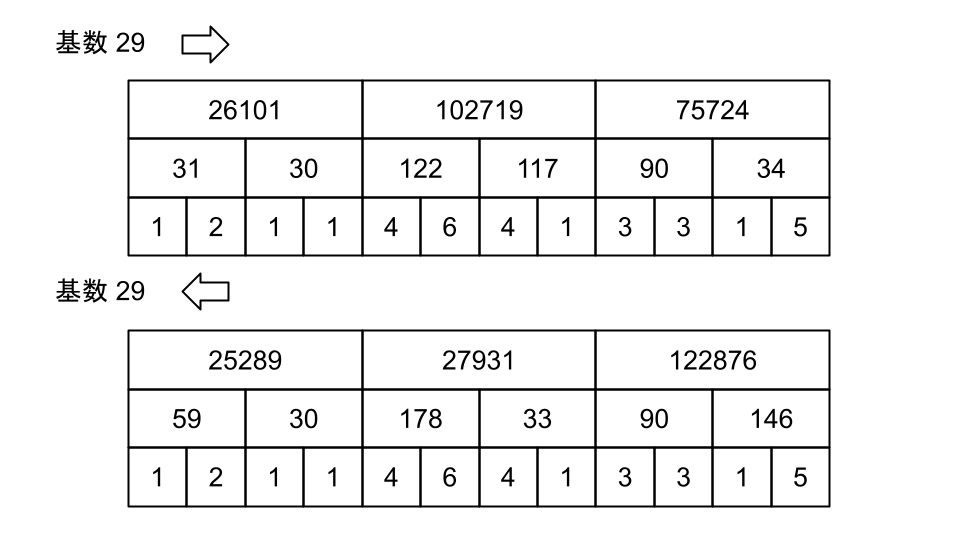
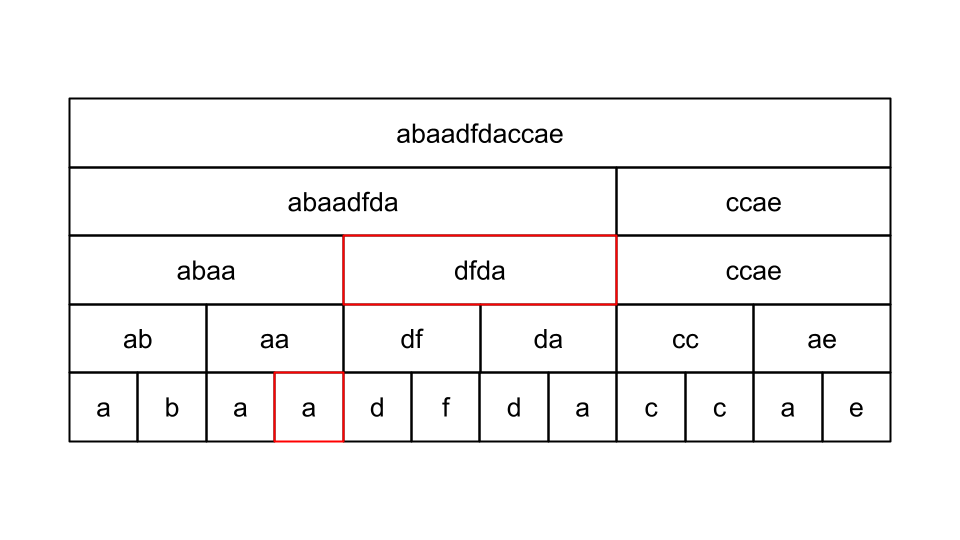
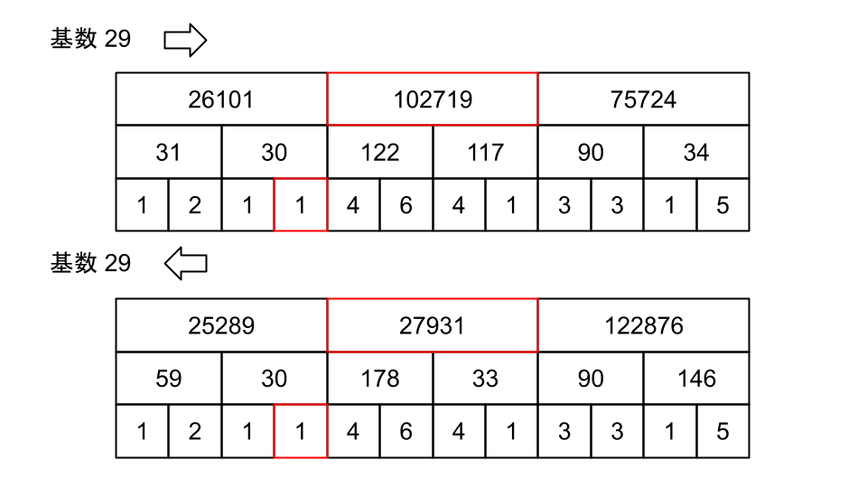

<script type="text/javascript" id="MathJax-script" async src="https://cdn.jsdelivr.net/npm/mathjax@3/es5/tex-chtml.js"></script>

# ABC331 F問題

この問題は公式の解説にRolling Hash系の問題との記載があったので、こっちに記載しておきます。

ただこの問題にはローリング要素がなく、ただのハッシュ化した文字列データを扱います。

そして最も難しい点は、ハッシュ化データをそのようにセグメントツリーに載せるかという点です。

思考の流れとしては、各クエリに\\(O(logN)\\)かそれより高速に応答したい。文字列なのでハッシュ化をしてみよう。単一更新区間クエリなのでセグメント木。セグメント木にハッシュをどのように乗っけようという流れになります。

## ハッシュ with セグメント木

文字列データをハッシュ値として扱いましょう。ハッシュ化の方法は<a href="https://genta23.github.io/docs/AtCoder_v2/rolling_hash/rolling_hash.html" target="_blank">別の記事</a>を参考にしてください。

- abc = 902, cba = 2582, bab = 1713

こんな感じで数字として扱ってみます。今回は区間の回文判定がしたいので、

- その区間における文字列を左から見た時のハッシュ値
- その区間における文字列を右から見た時のハッシュ値

これらのハッシュ値が一致した時に、文字列の一致を考えます。

### 文字列の連結とハッシュ値の合成 (具体例)

文字列を連結した際、ハッシュ値にはどのような加工を及ぼせばいいのでしょうか。

\\(vw\\)と\\(xyz\\)を連結してみましょう。(基数を\\(b\\)とする、modを省略)

\\[vw = vb + w\\]

\\[xyz = xb^2 + yb + z\\]

\\(vw\\)を\\(xyz\\)の左側から連結すると、

\\[vwxyz = vb^4 + wb^3 + xb^2 + yb + z = Hash(vw) \times b^3 + Hash(xyz)\\]

\\(vw\\)を\\(xyz\\)の右側から連結すると、

\\[xyzvw = x^4 + yb^3 + zb^2 + vb + w = Hash(xyz) \times b^2 + Hash(vw)\\]

つまり、文字列連結後のハッシュ値は、連結前のそれぞれのハッシュ値に<b>ある演算</b>を施すことによって\\(O(1)\\)で計算することができます。

### 文字列の連結とハッシュ値の合成 (一般化)

ある演算は文字列\\(S\\)と文字列\\(T\\)、この順で連結することを示す演算子\\(+\\)によって以下のように表現することができます。

\\[Hash(S + T) = Hash(S) \times b^{\|T\|} + Hash(T)\\]

これは文字列を左から考えたときのハッシュ値の計算方法であり、右から考えた時のハッシュ値は上記の演算を逆にして、

\\[Hash(S + T) = Hash(S) + Hash(T) \times b^{\|S\|} \\]

のように考えます。

### セグメント木に載せる

演算をしっかり考察したので、後は簡単です。

区間最小値のクエリだと、二項演算がminだったように、今回の二項演算に上記の演算を設定しましょう。

### イメージ

- 文字列を数字として扱う



- セグメント木に載せる



- ハッシュ値をセグメント木に載せる



- セグメント木と回文判定例 (adfdaという文字列を判定してみる)





- \\(1 \times 29^4 + 102719 = 810000\\)
- \\(1 + 27931 \times 29^1 = 810000\\)

一致したため回文である。

今回の一連の解説ではmodを省略していることや、ハッシュの衝突可能性については言及していないことに留意すること。

## コード

```cpp
int mod[5] = {998244353, 1000000007, 1000000009, 1000000021, 1000000033};
struct Data { ll htor, htol, b; int m; };

template <typename T> class RMQ {
public:
    const T INF = numeric_limits<T>::max();
    int n;         // 葉の数
    vector<T> dat; // 完全二分木の配列
    RMQ(int n_) : n(), dat(n_ * 4, INF) { // 葉の数は 2^x の形
        int x = 1;
        while (n_ > x) x *= 2;
        n = x;
    }

    void update(int i, T x) {
        i += n - 1;
        dat[i] = x;
        while (i > 0) {
            i = (i - 1) / 2;  // parent
            T vl = dat[i * 2 + 1], vr = dat[i * 2 + 2];
            dat[i] = {(vl.htor * vr.b + vr.htor) % vl.m, (vl.htol + vr.htol * vl.b) % vl.m, (vl.b * vr.b) % vl.m, vl.m};
        }
    }

    // the minimum element of [a,b)
    T query(int a, int b) { return query_sub(a, b, 0, 0, n); }
    T query_sub(int a, int b, int k, int l, int r) {
        if (r <= a || b <= l) return {0, 0, 1, dat[k].m}; // 範囲外
        else if (a <= l && r <= b) return dat[k]; // 範囲内
        else {
            T vl = query_sub(a, b, k * 2 + 1, l, (l + r) / 2);
            T vr = query_sub(a, b, k * 2 + 2, (l + r) / 2, r);
            return {(vl.htor * vr.b + vr.htor) % vl.m, (vl.htol + vr.htol * vl.b) % vl.m, (vl.b * vr.b) % vl.m, vl.m};
        }
    }
};

int main(){
    int n, q; cin >> n >> q;
    string s; cin >> s;
    ll b = 29;

    // 左からのハッシュ化, 右からのハッシュ化, 桁数を基数を用いて表現した数, mod
    vector<RMQ<Data>> data(5, RMQ<Data>(n));
    rep(i, 5) rep(j, n) data[i].update(j, {s[j]-'a'+1, s[j]-'a'+1, b, mod[i]});

    rep(i, q){
        int tmp; cin >> tmp;
        if(tmp == 1){
            int x; char c; cin >> x >> c; x--;
            rep(i, 5) data[i].update(x, {c-'a'+1, c-'a'+1, b, mod[i]});
        }
        else if(tmp == 2){
            int l, r; cin >> l >> r; l--, r--;
            bool flag = true;
            rep(i, 5) if(data[i].query(l, r+1).htor != data[i].query(l, r+1).htol) flag = false;
            cout << (flag ? "Yes" : "No") << endl;
        }
    }
    return 0;
}
```

動作が2400ms程度とTLEギリギリである。(今回の時間制限は3000ms)

ハッシュの衝突を回避するために、5個の異なるmodによってハッシュ値の計算を行っているが、そこまで必要ないため3個にしても良い。その場合は2000ms以下に抑えることができる。

しかし、公式回答は5個のmodを使用しても500ms程度のため、自分の実装が遅い実装であることは確か。改善の余地あり。

## 追記

コード眺めてたら、segtreeの初期値を変更してなかった。これ右端のクエリがテストケースにないだけで、たまたまの可能性あり？

```cpp
dat(n_ * 4, INF)
/* 変更 */
dat(n_ * 4, {0, 0, 1, 1})
```

あと区間外のときのマスク(単位元)はあれでよかったのか疑問。(おそらく大丈夫だけど)

まぁ悩むより手を動かしましょうか。

<em>Done is better than perfect.</em>