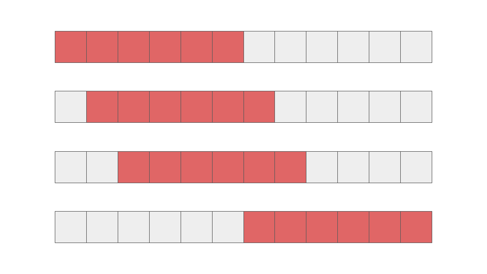
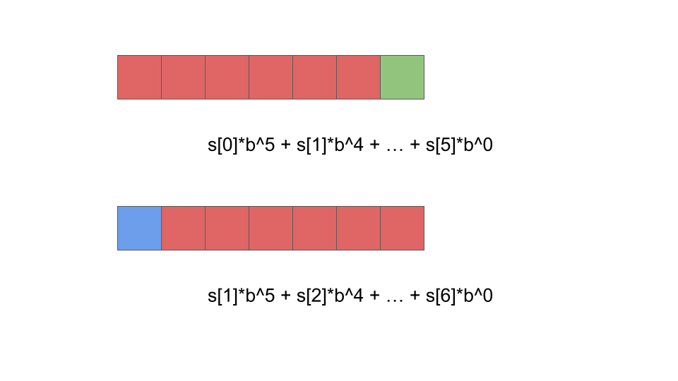
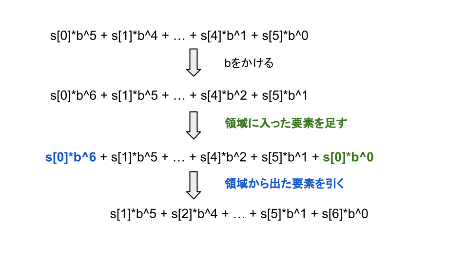

# Rolling-Hash

文字列検索の際に高速で動作するアルゴリズムです。

例えば、文字列\\(S\\)の中に文字列\\(T\\)が含まれるかを判定せよ、という問題に対して有効です。

今回は初歩の解説を行います。

## ナイーブな実装

このように左から比較していくと、計算量は\\(O(N^2)\\)となり、制約が大きいが場合TLEしてしまいます。

## 文字列のハッシュ化

文字列をハッシュ値として管理します。文字列a, b, c...は1, 2, 3...のように置き換えます。(0, 1, 2...のように置き換えるのはNG aとaaのハッシュ値がどちらも0になってしまうため)

文字列のハッシュ値は、以下のように表現されます。(bとpは互いに素)

\\[\sum^{n-1}_{i=0}s_ib^{n-1-i}\,\, (mod\, p)\\]

## ローリング

ハッシュの計算には\\(O(N)\\)の時間がかかってしまうため、計算を繰り返し行うと\\(O(N^2)\\)となり、何も変わらないじゃん！！ってなります。

ここでローリングという操作を行います。簡単に言うと、「結局探索領域の両端にのみ着目すればよくないか？」というものになります。

このときのハッシュ値の違いを詳しく調べてみましょう。以下の図をご覧ください。

このような3ステップの操作でハッシュ値を求めることができます。

つまりrolling hashとは、最初のハッシュ値を求める際のみ\\(O(N)\\)かかり、その後は\\(O(1)\\)で隣接文字列のハッシュ値が求まるアルゴリズムです。

テンプレの作成などはまだしていませんが、今回rolling hashの簡単な説明でした。

