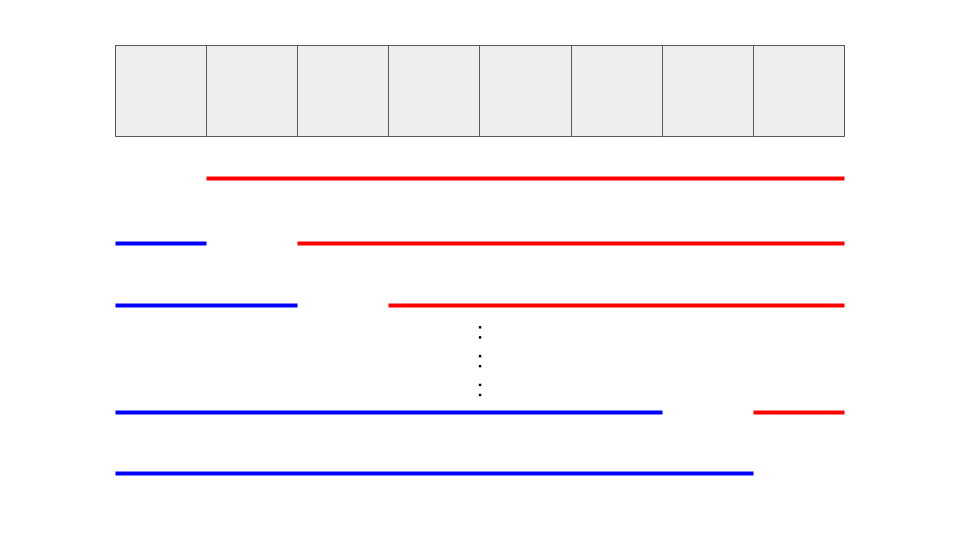

<script type="text/javascript" id="MathJax-script" async src="https://cdn.jsdelivr.net/npm/mathjax@3/es5/tex-chtml.js"></script>

# 区間の最大公約数

区間の最大公約数を求める問題です。segment treeを使用します。

0の約数は0を除くの任意の整数って知ってましたか。(私は知りませんでした。)

例題 : <a href="https://atcoder.jp/contests/abc125/tasks/abc125_c" target="_blank">C - GCD on Blackboard</a>

## 使用するテンプレート

```cpp
/* RMQ：[0,n-1] について、区間ごとの最小値を管理する構造体
    update(i,x): i 番目の要素を x に更新。O(log(n))
    query(a,b): [a,b) の最大公約数を取得。O(log(n))
*/
template <typename T>
class RMQ {
public:
    const T INF = numeric_limits<T>::max();
    int n;         // 葉の数
    vector<T> dat; // 完全二分木の配列
    RMQ(int n_) : n(), dat(n_ * 4, INF) { // 葉の数は 2^x の形
        int x = 1;
        while (n_ > x) {
            x *= 2;
        }
        n = x;
    }

    void update(int i, T x) {
        i += n - 1;
        dat[i] = x;
        while (i > 0) {
            i = (i - 1) / 2;  // parent
            dat[i] = gcd(dat[i * 2 + 1], dat[i * 2 + 2]);
        }
    }

    // the minimum element of [a,b)
    T query(int a, int b) { return query_sub(a, b, 0, 0, n); }
    T query_sub(int a, int b, int k, int l, int r) {
        if (r <= a || b <= l) {
            return 0;
        } else if (a <= l && r <= b) {
            return dat[k];
        } else {
            T vl = query_sub(a, b, k * 2 + 1, l, (l + r) / 2);
            T vr = query_sub(a, b, k * 2 + 2, (l + r) / 2, r);
            return gcd(vl, vr);
        }
    }
};
```

1点更新の区間最小値取得問題 RMQのテンプレートとは、いくつか異なる点があります。
- <b>update や query の更新関数が min ではなく gcd</b>
- queryのとき範囲外の要素にマスクをする必要があるが、その値がINFではなく0 (minならINF、gcdなら0、影響がでない値)

参考サイト : <a href="https://algo-logic.info/segment-tree/" target="_blank">セグメント木を徹底解説！0から遅延評価やモノイドまで</a>

## コード

```cpp

// 上記の区間最大公約数取得テンプレート

int main(){
    int n; cin >> n;
    vector<int> a(n); rep(i, n) cin >> a[i];

    // segment treeの構築
    RMQ<int> rmq(n);
    rep(i, n) rmq.update(i, a[i]);

    int ans = 0;
    rep(i, n){
        int l_gcd = rmq.query(0, i);
        int r_gcd = rmq.query(i+1, n);
        chmax(ans, gcd(l_gcd, r_gcd));
    }

    cout << ans << endl;
    return 0;
}
```

## 別解

この問題って要は、任意の1個の要素を除外して最大公約数を求めた場合の最大値を求めろということなので、左側と右側からの累積gcdを使用することによって簡単に求めることができます。(すべてのパターンについて愚直にgcdを計算すると\\(O(n^2)\\)となりTLEする。)



イメージとしてはこんな感じです。このような工夫で計算量が減るのは面白いですね。

### コード

```cpp
int main(){
    int n; cin >> n;
    vector<int> a(n); rep(i, n) cin >> a[i];

    // 累積の計算
    vector<int> left(n+1), right(n+1);
    for(int i=0; i<n; i++) left[i+1] = gcd(left[i], a[i]);
    for(int i=n-1; i>=0; i--) right[i] = gcd(right[i+1], a[i]);

    // 集計
    int res = 0;
    rep(i, n) chmax(res, gcd(left[i], right[i+1]));

    cout << res << endl;
    return 0;
}
```

この手法は前処理を行うことで左側gcdや右側gcdを早く呼べるようにしています。

segment treeを使用する方法は、左側gcdや右側gcdをその都度、高速なデータ構造でゴリ押しているっていう感じがします。