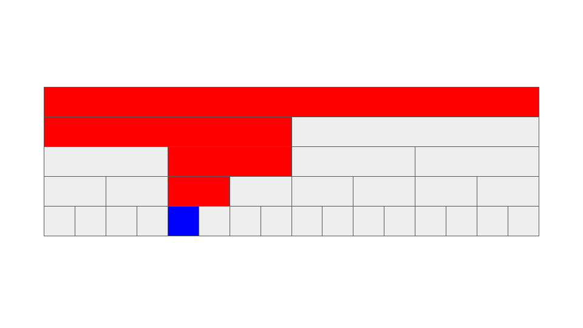
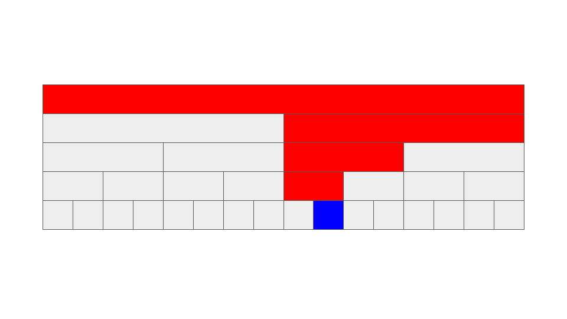
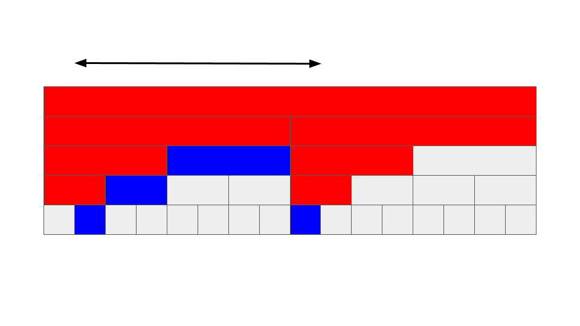

# segment treeを理解したい

解説で非常にわかりやすいサイトがあるため、基本的にはそこを中心に学習しました。

- <a href="https://algo-logic.info/segment-tree/" target="_blank">セグメント木を徹底解説！0から遅延評価やモノイドまで</a>
- <a href="https://maspypy.com/segment-tree-%E3%81%AE%E3%81%8A%E5%8B%89%E5%BC%B71" target="_blank">Segment Tree のお勉強</a>
- <a href="https://kyoroid.github.io/algorithm/structure/interval/segment_tree.html" target="_blank">3.2.2. セグメント木</a>

基本的な話に関しては、こちらのサイトを参照してください。

ここページではイメージの図を作成しただけです。

## segment tree (normal)

segment treeとは

- ある1点の更新
- 任意の区間上の最小値や合計値などの取得

を\\(O(logN)\\)で行うことができるデータ構造です。

完全二分木の形でデータを持っておくことによって、区間に関するクエリに高速に応答することができます。

- 青 : 重要な情報の格納場所
- 赤 : 青の参照や更新に伴い、利用される場所

### ある1点の情報の更新

### 区間情報の取得

### 最小値取得の場合

    <iframe src="https://docs.google.com/presentation/d/e/2PACX-1vSy4vhYyOX9SW5PzdKg7CSbjuZWOAKjh61RhwPo4UGugbDFs0SrQzCRvTbdNyP_E37Pcj7txLTwrnm6/embed?start=false&loop=false&delayms=1000" frameborder="0" width="80%" height="100%" allowfullscreen="true" mozallowfullscreen="true" webkitallowfullscreen="true"></iframe>

