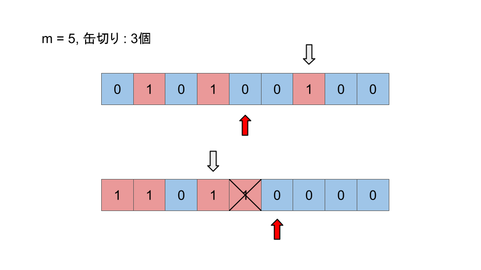

<script type="text/javascript" id="MathJax-script" async src="https://cdn.jsdelivr.net/npm/mathjax@3/es5/tex-chtml.js"></script>

# ABC312 F問題

## 思考ログ

条件の与えられる順は関係なく、大きさが重要になってくる。

シンプルな貪欲方で解くことができそう。



\\(t = 2\\)を固定して見ていく、これが最初のイメージ。でも何か上手くいかなかったので、方針変更。

次に、\\(t = 1\\)を固定してみていく。\\(t = 1\\)のものを\\(i = 0, 1,...\\)個選択したとき、何個\\(t = 2\\)を選択する必要があるか。そして、残りの数だけ\\(t = 0\\)のもの選択する。

要素が0の時とかの特殊例を考えることが難しく、解くのに時間がかかってしまった。

そのため、探索するものの条件を整理してから判定に移ることでACすることができた。

### コード

```cpp
int main(){
    int n, m; cin >> n >> m;
    vector<ll> t(n), x(n); rep(i, n) cin >> t[i] >> x[i];

    vector<vector<ll>> g(3);
    rep(i, n) g[t[i]].push_back(x[i]);
    rep(i, 3) sort(g[i].begin(), g[i].end(), greater<ll>());  

    /* 累積和 */
    rep(i, 3) rep(j, g[i].size()) if(j > 0) g[i][j] += g[i][j-1];

    /* 探索候補の整理　 */
    vector<pair<int, int>> cnd;
    cnd.push_back({0, 0});
    rep(i, g[1].size()){
        auto it = lower_bound(g[2].begin(), g[2].end(), i+1);
        if(it == g[2].end()) continue; // その数を選択することは不可能
        int dis = distance(g[2].begin(), it) + 1;
        cnd.push_back({i+1, dis});
    }

    /* 実際に比較を行う */
    ll ans = 0;
    rep(i, cnd.size()){
        int hp = m - (cnd[i].first + cnd[i].second);
        if(hp < 0) continue; // この時は条件を満たさないため再現できない
        hp = min(hp, (int)g[0].size());

        ll tmp = 0;
        if(hp > 0) tmp += g[0][hp-1];
        if(cnd[i].first > 0) tmp += g[1][cnd[i].first-1];

        chmax(ans, tmp);
    }
    cout << ans << endl;
    return 0;
}
```

## メモ

なんかdistanceの使い方をミスっていたような気がする。

あと、g.size()はunsignedだから0の状態から引くと大変なことになりそう。

最初考えた方法でも解けそうだけど、結構めんどくさそう。わざわざ面倒な手法を取る必要はない。