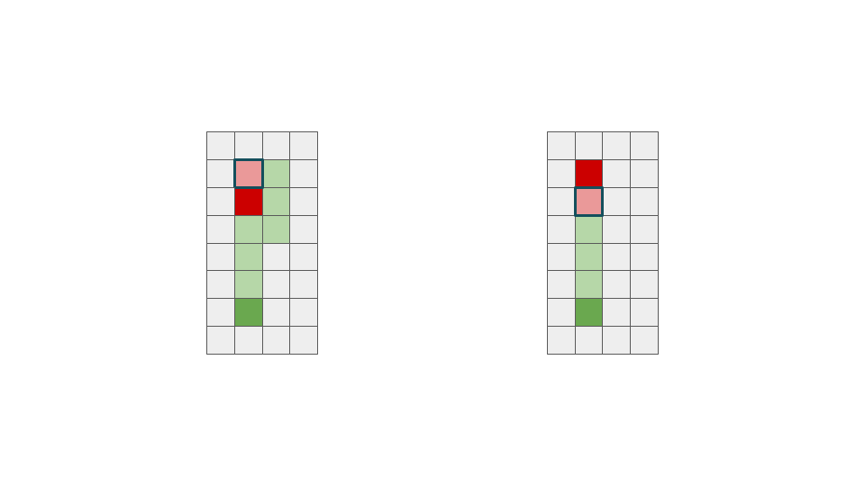

<script type="text/javascript" id="MathJax-script" async src="https://cdn.jsdelivr.net/npm/mathjax@3/es5/tex-chtml.js"></script>

# ABC323 F問題

荷物を押し運びする問題。青鬼など一部のゲームにおける家具類の押し方はこれ。制約が大きからlong longを使おう。


以下では図1のように、プレイヤー系を緑、荷物系を赤、ゴールを青と表現する。

この問題は2段階に分けることができる。

- 初期位置から荷物を押せる位置に動く
- 荷物を目的地まで押し運ぶ

後半の考察の方が楽そう。後半から考察してみる。

## 荷物を目的地まで運ぶ段階 (後半)


荷物を押し運ぶときは、図2のようなパターンを考えることができる。今回は運搬中に障害物はないということを仮定しているため、後半の考察は非常に簡単である。

荷物とゴールの行または列が同じ時、プレイヤーの移動距離は、荷物とゴールのマンハッタン距離は等しくなる。

それ以外のとき、曲がる回数はできる限り少ないようが望ましい(図2 左)。この場合は、プレイヤーの移動距離は、荷物とゴールのマンハッタン距離 + 2となる。

まとめ
- manhattan(荷物, ゴール) (if 荷物とゴールの行または列が同じ)
- manhattan(荷物, ゴール) + 2 (otherwise)

## 荷物を運ぶためにプレイヤーが向かう位置 (前半)


荷物を運ぶためには、プレイヤーは図3の薄赤のブロックを目指す必要がある。


荷物とゴールの行または列が同じ場合、プレイヤーが目指す場所は1意に定まるが、そうではない場合、2個の選択肢が存在する。


2個の選択肢が存在する場合、初期位置からマンハッタン距離が近い場所を目指せば良い。



問題なのは、選択肢が1個しかないケース。さらに、荷物の向こうに行く必要があるとき。荷物がある場所を迂回する必要があるため、プレイヤーと荷物を押すための目的地のマンハッタン距離 + 2とする必要がある。

まとめ
- manhattan(プレイヤー, 薄赤) + 2 (if 荷物とゴールの行または列が同じ)
- manhattan(プレイヤー, 薄赤) (otherwise)

## 流れ

1. 荷物とゴールの位置から判定 (+2するべきか)
2. 荷物を押すためにまず移動するべき場所を求める
3. 2で求めた場所とプレイヤーの位置から判定 (+2するべきか)
4. 前半の最短距離と後半の最短距離の和が解となる

## さらに考察

荷物を押すためにまず移動するべき場所は、荷物がある位置から+1または-1回の移動で到達することができる。

その判定を行えばもっと実装を軽くできるのではないか。

a, b, cまたはc, b, aの順でならんでいる場合、-1(最小値が知りたいため、この条件は+1よりも優先される)。

## コード

```cpp
int main(){
    ll xa, ya, xb, yb, xc, yc;
    cin >> xa >> ya >> xb >> yb >> xc >> yc;
    
    bool flag_bc = true;
    if(xb == xc) flag_bc = false;
    if(yb == yc) flag_bc = false;

    bool flag_abc = true, flag_ab = false;
    if((xa < xb && xb < xc) || (xc < xb && xb < xa)) flag_abc = false;
    else if((ya < yb && yb < yc) || (yc < yb && yb < ya)) flag_abc = false;
    else{ if((xa == xb && xb == xc) || (ya == yb && yb == yc)) flag_ab = true; } 

    ll ans = 0;
    ans += (abs(xa - xb) + abs(ya - yb));
    ans += (abs(xb - xc) + abs(yb - yc));
    ans += (flag_bc ? 2 : 0);
    ans += (flag_abc ? 1 : -1);
    ans += (flag_ab ? 2 : 0);

    cout << ans << endl;
    return 0;
}
```