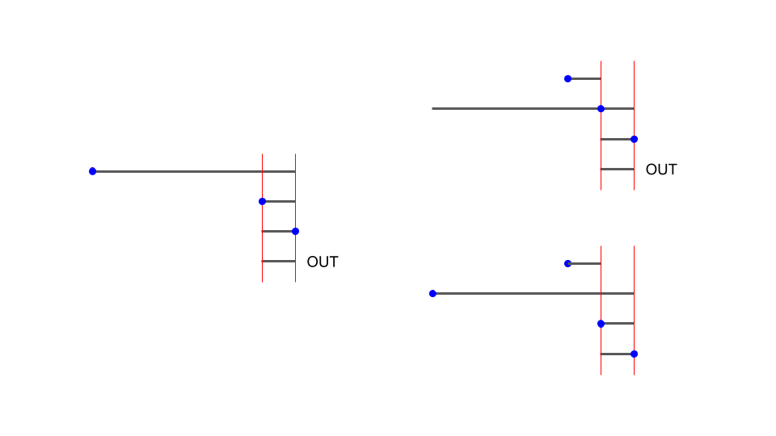
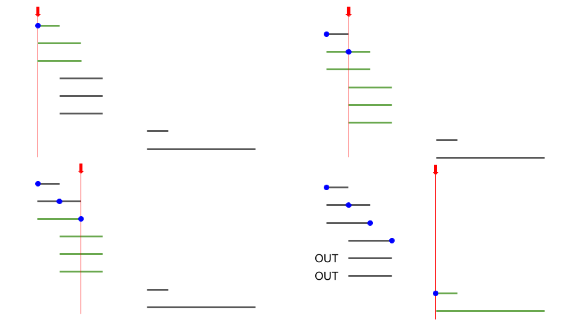

<script type="text/javascript" id="MathJax-script" async src="https://cdn.jsdelivr.net/npm/mathjax@3/es5/tex-chtml.js"></script>

# ABC325 D問題

ある時刻tにおいて、印字機の中に入っている商品の中で、デッドラインが早いものを優先的に選択

## 思考ログ

### デッドラインを基準にソートする

1. 印字機から出るタイミングを第一引数、印字機に入るタイミングを第二引数として、ソートを行う。
2. 印字可能な時間を考えていき、それがデッドラインを超えた場合は、押せないような判定を行う。
   


結論、このアルゴリズム(図左)は間違い。

図の右で分かるように本来なら押せるような状況もOUTという判定をしてしまう。

### 印字機に入る時間を基準にする。



- 赤 : 今見ている時刻(時刻t)
- 青 : 印字した時間
- 緑 : 優先度付きキューによってデータを保持されている商品

1. ある時刻tに印字機内にある商品、かつまだ印字されてないもののデッドラインを優先度付きキューで保有しておく。
2. 印字を行った場合は、tをインクリメントし、1に戻る。図の赤矢印がデッドラインを追い越したものはOUT

tをインクリメントし続けると、探索回数が一気に増えてしまうため、機会が空になる時刻をスキップする。

そのための条件は優先度付きキューがemptyになること。emptyになったら次に商品が印字機に入る時刻までスキップ。

### コード

```cpp
int main(){
    int n; cin >> n;
    vector<ll> t(n), d(n); rep(i, n) cin >> t[i] >> d[i];
    vector<ll> e(n); rep(i, n) e[i] = t[i] + d[i];

    vector<pair<ll, ll>> data(n);
    rep(i, n){
        data[i].first = t[i];
        data[i].second = e[i];
    }
    sort(data.begin(), data.end());

    ll piv = data[0].first;
    min_priority_queue<ll> que;
    ll ans = 0;
    auto itr = data.begin();
    while(itr != data.end()){
        // 時刻tに印字機に入るデータを全て優先度付きキューに挿入
        while((*itr).first == piv){
            que.push((*itr).second);
            itr++;
        }
        ll tmp = (*itr).first;

        // 次に新しい商品が印字機に入る場合処理を打ち切る
        while(piv != tmp){
            if(que.empty()){
                piv = tmp; // キューが空になったらtをスキップする
                break;
            }
            ll v = que.top(); que.pop();
            if(v < piv) continue;
            else{
                ans++;
                piv++;
            }
        }
    }
    cout << ans << endl;
    return 0;
}
```