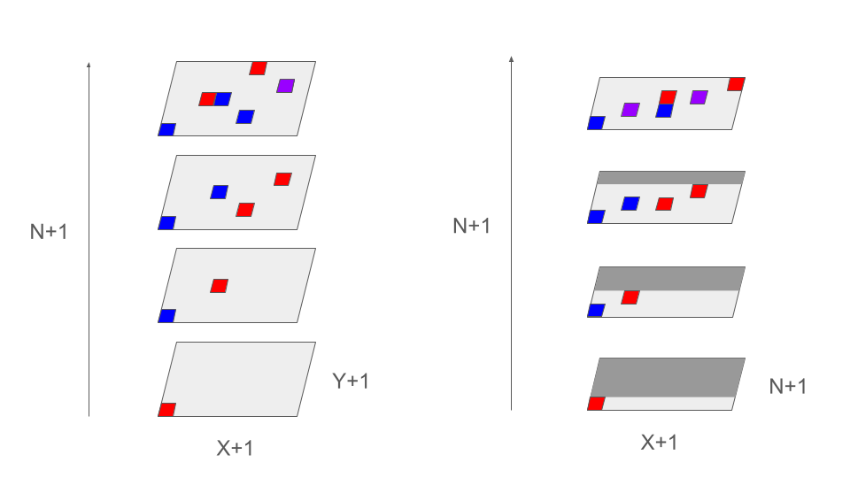

# 364e

\\(N\\)個の料理と、その料理に関する甘さ\\(A_i\\)と、しょっぱさ\\(B_i\\)が与えられる。それぞれの総和が\\(X, Y\\)を超えた瞬間、それ以上は食えない。最大何品食えるか。

## 解答

\\(X, Y\\)以下という制約を守りつつ、食べれる個数を\\(M\\)とすると、解は\\(min(M+1, N)\\)となる。したがってこの\\(M\\)を考える。

ナイーブな実装を考えてみよう。問題はこのように言い換えれる。i番目の要素までを利用し、j以下の甘さとk以下のしょっぱさという制限下で食える最大値を求めよ。

しかし、この手法の計算時間は\\(O(NXY)\\)であるため、TLEとなる。

そこで、DPのキーと値を入れ替えるという典型的なアプローチを考える。

i番目の要素までを使用し、j個選択し食べる。k以下の甘さという条件下で、しょっぱさの最小値を求めていく。

最終的に、n個全ての要素を使用したDPデーブルの中から、しょっぱさの最小値が\\(Y\\)以下であるものをピックアップする。その中での最大選択品数が\\(M\\)である。